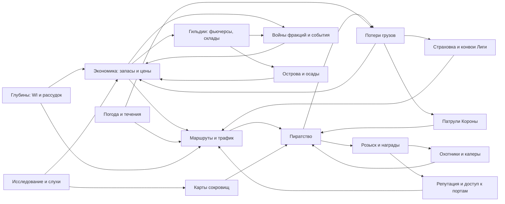

# GRAVETIDE — GDD 01: Мир, экономика и живой океан

> Часть **GAME DESIGN FOUNDATION**. Версия 0.1 (черновик ведущего геймдизайнера).
> Все идентификаторы регионов, портов, фракций, капитанов, классов кораблей, деревьев талантов, зон безопасности и уровней розыска взяты из `00_CANON.md`. При расхождении прав канон.
> Новые имена, которых нет в каноне (малые гавани, течения, события), помечены как **предложение для канона**; до внесения в `00_CANON.md` их id считаются предварительными.

---

## 0. Условные обозначения и базовые единицы

| Величина | Правило |
|---|---|
| Валюта | **золото (g)**. Единственная «твёрдая» валюта; векселя Лиги — бумажный заменитель (§6.10). *Согласование:* GDD 02 называет валюту «серебро (`silver`)», а GDD 03 и 07 используют золото / g. Нужно решение в каноне (§18.3). Товар «серебряные слитки» получил id `silver_bullion`, чтобы не занимать `silver` |
| Игровое время | 1 игровые сутки = **120 мин** реального времени (день 80 мин, ночь 40 мин), как в GDD 02; 1 игровой час = 5 мин |
| Прилив | полный цикл прилив→отлив→прилив = **60 мин** реального времени (два прилива за игровые сутки, полусуточный ритм) |
| Расстояние | **игровой км** (1 км = 1 000 м мира GDD 02). Мир = 120 × 80 км |
| Скорость | узлы GDD 02 (1 уз = 1,5 м/с ≈ 0,09 км/мин); для навигации пересчитываем в км/мин. Быстрый корабль на лучшем курсе идёт ≈ 1,2 км/мин |
| Корабли | Ход, осадку, трюм, экипаж и цены кораблей задаёт GDD 02 §1. Здесь только их экономические и навигационные следствия |
| Масса / объём | т и кг / м³. У трюма два лимита: грузоподъёмность (т) и объём (м³) |
| Экономические ставки | «в час» = реальный час, если не указано иное |
| Округление цен | до целого g; цена пересчитывается после каждой партии в 10 ед. (проскальзывание) |

---

## 1. Главная концепция и философия

### 1.1 Концепция в одном абзаце

GRAVETIDE — мрачная песочница про океан, где **каждая бочка настоящая**. Сахар, порох, жемчуг и проклятые реликвии физически лежат в трюмах NPC- и игровых кораблей. Кто-то должен провезти их через туман, шторм, пиратские воды и то, что шевелится под килем. Цены везде локальные, информация о них стареет, а любое решение (ограбить, пропустить, сопроводить, сдать властям) имеет цену. Эта цена отражается в репутации, розыске, слухах и в экономике соседних портов. Эпоха на 80% реалистичная и суровая, на 20% это мистика глубин, и чем дальше корабль уходит от Black Coast, тем больше вторая часть вытесняет первую.

> «Океан — это мир. Корабль — это персонаж. Капитан — это билд игрока».

### 1.2 Философия дизайна (принципы-фильтры)

Каждая новая механика должна пройти все восемь фильтров. Если не проходит, её перерабатывают или вырезают.

| # | Принцип | Практический смысл |
|---|---|---|
| P1 | **Физичность** | Нет глобального аукциона и телепорта груза. Всё, что продаётся в порту, туда кто-то привёз: NPC-торговец или игрок |
| P2 | **Локальность и старение знаний** | Цены, слухи и карты привязаны к месту и времени. Игрок видит «последнюю известную цену» с датой |
| P3 | **Риск = доход** | Самые выгодные маршруты проходят через contested/lawless воды, штормы и аномалии |
| P4 | **Море помнит** | Розыск, репутация, милосердие/жестокость и слухи копятся и меняют поведение мира к игроку |
| P5 | **Эмерджентность важнее скрипта** | Мы делаем взаимосвязанные системы, а не цепочки квестов. Сюжет складывается из столкновения интересов |
| P6 | **Читаемость сверху** | Всё важное видно с top-down камеры: силуэт паруса, цвет флага, фронт шторма, клеймо груза (через подзорную трубу), туман |
| P7 | **Монетизация: дублоны** | Премиум-валюта — дублоны — покупается только за реальные деньги и никогда не добывается в игре: ни наградой, ни торговлей, ни находкой. Баланс — на аккаунте, каждое движение — строка журнала. За дублоны в Лавке продаются премиум-корабли и премиум-существа (позже — и другое); ни верфь за серебро, ни укротитель, ни логово, ни дрейф, ни захват их не дают. Решение владельца 2026-10-03 заменяет прежнее «золото и силу за деньги не продаём». Premium-капитаны (`drowned`, `admiral`) остаются side-grade |
| P8 | **Уважение ко времени** | Сессия 30–120 мин всегда даёт ощутимый результат: прибыль, открытие, историю, прогресс |

### 1.3 Фантазии игрока

| Фантазия | Что делает игрок | Ключевые системы | Типичный капитан / деревья | «Момент славы» |
|---|---|---|---|---|
| **Торговый магнат** | Арбитраж, контракты, фьючерсы, склады в трёх регионах | §6, §8, §9 | `smuggler`, `admiral` / `trade`, `command` | Скупил весь порох Cinderhold перед Армадой и продал Короне втрое дороже |
| **Контрабандист** | Возит запрещённое мимо таможни, отмывает клеймёный груз | §6.6, §7, §11 | `smuggler` / `smuggling`, `navigation` | Провёл шхуну с проклятыми реликвиями сквозь досмотр в Gravesend |
| **Охотник за головами** | Берёт награды Короны и частные заказы, выслеживает Wanted 3–5 | §11, §14 | `corsair`, `navigator` / `gunnery`, `exploration` | Взял «Врага Короны» живым и сдал его в Gravesend |
| **Исследователь** | Картография, открытия, продажа карт и слухов | §4, §14, §15 | `navigator` / `exploration`, `survival` | Первым нанёс на карту новый вулканический остров, и тот носит его имя |
| **Пират** | Грабит конвои, живёт в пиратских гаванях, растит Infamy | §5, §11, §10 | `reaver`, `corsair` / `boarding`, `gunnery` | Захватил серебряный галеон Короны и продал его на аукционе Tidewrack |
| **Капер** | Грабит законно, по патенту | §11.7, §10 | `corsair` / `gunnery`, `command` | Разорил пиратскую гавань и получил патент II ранга |
| **Владелец флота** | 3–8 кораблей, наёмные NPC-капитаны на маршрутах, эскорт | §5.5, §8.4 | `admiral` / `command`, `trade` | Собственный конвой из пяти флейтов дошёл до Harpoon's Rest без потерь |
| **Хозяин баз** | Аренда островов, верфи, скрытые бухты, батареи | §9 | любой / `shipwright`, `command` | Остров отбил две осады подряд |
| **Лидер гильдии** | Логистика, политика, осады, фьючерсы, войны | §8, §9, §16, §17 | `admiral` / `command` | Гильдия держит цену на железо во всём Gravewater |
| **Легенда** | Infamy, уникальные титулы, Legend-квест | §11, §13 | любой (Legend-квест 40–60 ч) | Имя в тавернах всех 10 ключевых портов, награда за голову 400 000 g |
| *Охотник на чудовищ* (доп.) | Контракты Ордена на левиафанов | §3.5, §16 | `corsair`, `drowned` / `gunnery`, `survival` | Кость левиафана на носу собственного корабля |
| *Сделка с глубиной* (доп.) | Хор Глубин, проклятые артефакты, Бездна | §13 | `drowned` / `abyssal` | Вернулся из The Abyss с экипажем, который всё ещё в своём уме |

### 1.4 Столпы дизайна

| Столп | Суть | Что из этого следует | Анти-столп (чего не делаем) |
|---|---|---|---|
| **I. Каждая бочка настоящая** | Экономика — это физическая логистика | NPC-торговцы реально везут груз; потопленный груз не доходит до порта | Нет глобального рынка и «волшебного склада» |
| **II. Горизонт — это решение** | Каждый парус на горизонте — выбор с последствиями | 9 вариантов реакции на NPC-судно (§5.3) | Нет «мобов», которые просто стоят и ждут убийства |
| **III. Море помнит** | Поступки накапливаются | Wanted, репутация 7 фракций, Mercy score, слухи из реальных событий | Нет сброса последствий кнопкой |
| **IV. Чем дальше — тем страшнее и богаче** | Градиент странности | Индекс странности WI от 5 до 95, множители ценности и опасности | Нет «безопасного фарма» лучших ресурсов |
| **V. Корабль — персонаж, капитан — билд** | Прогресс вшит в корабль и таланты | Трюм, осадка и такелаж меняют экономические решения | Нет прогресса «по уровню персонажа» ради цифры |
| **VI. Истории, а не квесты** | Системы сталкиваются и порождают сюжет | §17 — матрица влияний и эмерджентные сценарии | Нет сюжетных «рельсов» в открытом мире |

### 1.5 Паспорт системы: концепция

| Аспект | Содержание |
|---|---|
| **Как работает** | Восемь принципов-фильтров и шесть столпов служат критерием приёмки любой фичи; фантазии игрока задают целевые роли, которые должны быть жизнеспособны экономически |
| **Зачем нужна** | Удерживает целостность огромной песочницы и не даёт документам по кораблям, бою и арту разъехаться |
| **Взаимодействие** | Каждый раздел ниже ссылается на столп, который реализует; арт-дирекция (`06_ART_DIRECTION.md`) держит пропорцию 80/20 |
| **Риски баланса** | Перекос в пользу одной фантазии (например, если пиратство выгоднее торговли в 3 раза, торговцы исчезнут, и пиратам станет некого грабить) |
| **Интерес на сотни часов** | 10+ фантазий комбинируются: сегодня торговец, завтра капер, через месяц лидер гильдии. Смена роли не требует нового персонажа, только другого корабля и другой ветки талантов |

---

## 2. Core gameplay loop

### 2.1 Микро-петля (10 секунд – 5 минут)

**Прочитать море → решить → сманеврировать → получить результат → адаптироваться.**

| Действие | Длительность | Решение игрока | Обратная связь сверху |
|---|---|---|---|
| Работа с парусами и курсом относительно ветра | постоянно | Бейдевинд или фордевинд, риск перегруза мачт | Индикатор ветра, вымпел, кильватерный след |
| Осмотр горизонта в подзорную трубу | 5–15 с | Кто это: торговец, патруль, игрок? Какой флаг и какая осадка (гружёный?) | Карточка судна: класс, флаг, осадка, клеймо |
| Реакция на встречу | 30 с – 2 мин | Одна из 9 реакций (§5.3) | Смена отношения NPC, риск Wanted |
| Бой / уклонение | 1–5 мин | Позиция к ветру, тип заряда, когда идти на абордаж | Повреждения секций, пожар, крен |
| Абордаж и дележ добычи | 1–3 мин | Что взять в ограниченный трюм, что выбросить | Трюм по весу и объёму, клеймо груза |
| Ремонт и перераспределение | 30–90 с | Потратить доски и парусину сейчас или дойти до порта | Скорость, течь, мораль |

### 2.2 Мезо-петля (сессия 45–120 минут)

| Фаза | Время | Содержание |
|---|---|---|
| 1. Порт: разведка | 3–8 мин | Рынок (цены + их возраст), доска контрактов, таверна (слухи), прогноз погоды у начальника порта |
| 2. Планирование | 2–5 мин | Маршрут, груз vs боезапас vs провизия, страховка, эскорт |
| 3. Переход | 15–60 мин | Ветер, течения, встречи, события, аномалии |
| 4. Кульминация | 5–20 мин | Бой, шторм, раскопка клада, прорыв блокады, погоня |
| 5. Развязка | 5–15 мин | Продажа (легальная, чёрный рынок, аукцион), ремонт, выплаты, отмывание клейма |
| 6. Инвестиция | 3–10 мин | Улучшение корабля, таланты, аренда, фьючерс, гильдейский склад |

Целевой результат сессии: **+1 значимое изменение состояния**. Это может быть новый корабль или модуль, прирост репутации до следующего ранга, открытый остров, карта сокровищ, смена уровня Wanted или вклад в гильдейскую цель.

### 2.3 Макро-петля (недели и месяцы)

| Ось прогресса | Горизонт | Содержание |
|---|---|---|
| Корабль и флот | 2–8 недель | `sloop` → `cutter`/`schooner` → `brigantine`/`brig`/`fluyt` → `frigate`/`galleon` → `man_o_war`; `ghost_ship` — endgame-корпус |
| Капитан | 1–3 месяца | 10 деревьев: `navigation`, `gunnery`, `boarding`, `command`, `trade`, `smuggling`, `survival`, `shipwright`, `exploration`, `abyssal` |
| Репутация | постоянно | 7 фракций, перекрёстные последствия (§10) |
| Владения | 2–6 недель | Аренда 7/14/30 дней, цепочки производства (§9) |
| Гильдия | месяцы | Порты, фьючерсы, осады, контроль маршрутов |
| Знание мира | постоянно | Карты, течения, сезонные сдвиги архипелага, легендарные клады сезона |
| Легенда | месяцы | Infamy, Legend-квест (~40–60 ч), титулы, упоминания в слухах |

**Сезон** длится 10 недель. Каждый сезон приносит новый легендарный клад, перегенерацию части малых островов `whispering` («Туманный сдвиг», §3.11), крупное событие-арку и сезонный рейтинг Легенд. Прогресс кораблей и капитанов между сезонами **не сбрасывается**.

### 2.4 Петля риска и награды

На HUD всегда видна **«Ценность на борту»** (VoB, Value on Board): сумма рыночной стоимости груза, карт и реликвий. Чем выше VoB, тем:
- больше шанс, что NPC-пираты выберут вас целью (вес цели ∝ √VoB);
- заметнее осадка (гружёный корабль сидит глубже, и это видно в подзорную трубу на дальности обнаружения);
- дороже страховка Лиги.

Ожидаемая выгода рейса для игрока складывается интуитивно из трёх вещей: маржа, вероятность потери и штраф за время. Задача дизайна — чтобы ни один маршрут не был строго доминирующим (см. §6.14).

### 2.5 Пример генерируемой истории (реальная сессия ~110 минут)

Игрок — капитан-архетип `corsair` (Edric Vane) на бригантине «Сорока» (`brigantine`, трюм 170 т / 230 м³ по GDD 02), Wanted 0.

1. **00:00, Saltmarrow (порт).** Покупает 4 бочки провизии и 5 бочек воды: запас на 3 игровых суток (6 ч) для экипажа из 28 человек, 500 кг. У начальника порта берёт прогноз: «через 40 мин с севера пойдёт штормовой фронт».
2. **00:06, рынок Porto Blackwater.** Сахар стоит 29 g (последняя известная цена в Hollowmere — 71 g, данным 2 часа). В таверне за 120 g покупает слух: «Конвои Лиги на Gravewater Run перехвачены, Hollowmere сидит без сахара». Слух настоящий: он сгенерирован из реальной статистики потерь.
3. **00:09, контракт.** Контракт Лиги: «500 сахара в Hollowmere в течение 3 ч, премия 3 500 g». Игрок берёт контракт, покупает 800 мешков сахара (40 т) и ещё 30 бочек пороха для гаваней Шепчущего Архипелага. Торговый патент I у него уже есть: без патента больше 30 т за час в одном порту не купить (§6.8). Порох — риск (§7.4), но в гаванях он стоит почти вдвое дороже. Страховку Лиги (4,1% от стоимости груза) пропускает, чтобы сэкономить.
4. **00:15, море.** Выходит на течение Gravewater Run (+35% к скорости). В подзорную трубу видит флейт Лиги (гружёный, эскорта нет) и в 1,5 км патрульный бриг Короны. Это ещё воды `black_coast` (safe): атака на NPC-торговца здесь означает мгновенный Wanted 2 и перехват патрулём, поэтому игрок проходит мимо.
5. **00:31, шторм.** Фронт догоняет раньше прогноза. Прямые паруса бригантины рвутся на порывах. Игрок уходит в подветренную сторону безымянного малого острова и ждёт.
6. **00:38, остров.** Отлив обнажил киль старого галеона. Салвидж за 90 с даёт 2 ящика оружия и **карту сокровищ** типа «фрагмент берега»: рисунок береговой линии и крест.
7. **00:52, Hollowmere.** Сдаёт 500 мешков по контракту: 500 × 70 g плюс 3 500 g премии, итого 38 500 g. Остальные 300 продаёт на рынке: цена сползает с 94 до 76, в среднем 85 g, итого 25 500 g. За вычетом пошлины 4% и закупки (~24 000 g) чистая прибыль рейса около 39 000 g. Столько приносит только кризис; в обычный день тот же рейс дал бы ~4 000 g (§6.4).
8. **01:05, Шепчущий Архипелаг.** Сопоставляет рисунок с картой и находит атолл. Раскопка занимает 120 с, над местом кружат чайки: это видимый маркер «шума».
9. **01:08, конфликт.** Подходит игровая бригантина «Вдова»: её капитан купил тот же слух в Fogmouth. Игрок стреляет первым. Ядро пробивает трюм «Сороки», срабатывает проверка детонации пороха: 30 бочек дают 12% шанс. Везёт, только пожар.
10. **01:14, абордаж.** Игрок берёт «Вдову» на абордаж. Добыча — 60 ящиков специй с **клеймом** (краденый груз, §6.6) и её копия той же карты. Это contested-воды, а маяк на соседнем острове — свидетель. Первый выстрел по игроку дал +1 000 очков розыска, абордаж с захватом груза ещё +1 000: **Wanted 2** (Известный пират).
11. **01:20, последствия.** Порты Короны для него теперь закрыты, а жертва вносит 3 000 g в банк награды за его голову. Итог: 7 200 g от Короны (100 × уровень капитана 18 × 2²) плюс 3 000 частных.
12. **01:32, пиратская гавань Rook's Nest** (`whispering`), которая открывается только при Wanted ≥ 2 (§10.4). Трофейный рынок берёт клеймёные специи по 72% цены с учётом доли Кодекса. Порох уходит по 104 g за бочку (купил по 55).
13. **01:40, улучшение.** На вырученные деньги ставит `armored_magazine` (бронированный погреб, GDD 02): −50% к шансу детонации. Очко таланта уходит в ветку `smuggling`, в `smg_hidden_compartments` (тайники, GDD 03).
14. **01:48, снова в море.** Сундук с атолла содержал фрагмент 1/4 легендарной карты сезона. Утром в тавернах трёх портов пойдёт слух: «Кто-то нашёл первую часть „Короны Утопленницы“». За «Сорокой» начинается охота.

Ни один шаг здесь не заскриптован. История получилась из пересечения экономики, погоды, прилива, живого океана, слухов, розыска и карт.

### 2.6 Паспорт системы: игровые петли

| Аспект | Содержание |
|---|---|
| **Как работает** | Микро-решения (курс, реакция на парус) складываются в сессию с явным результатом; сессии питают долгие оси прогресса |
| **Зачем нужна** | Даёт ритм «напряжение → разрядка → инвестиция» и гарантирует смысл в сессии любой длины |
| **Взаимодействие** | Микро опирается на погоду (§12) и живой океан (§5); мезо на экономику (§6) и контракты; макро на владения (§9), репутацию (§10) и сезоны |
| **Риски баланса** | Слишком длинные переходы без встреч (скука); слишком частые встречи (нет покоя для торговца). Цель — одна значимая встреча за 4–7 мин плавания в contested и за 2–4 мин в lawless |
| **Интерес на сотни часов** | Петли не фиксированы: состав фаз зависит от роли, региона, сезона и мировых событий. Одна и та же сессия «торговца» у Black Coast и в Leviathan Reach ощущается по-разному |

---

## 3. Структура мира

### 3.1 География: общий план

Мир — единый бесшовный океан размером **120 × 80 км**, около 9 600 км² водной поверхности с сушей. Black Coast лежит на западе, The Abyss на крайнем востоке, и путь с запада на восток — это путь вглубь странности.

```
x→ 0 км          22           60              95           120
 y ┌──────────────────────────────────────────────┬──────────┐ 0
 ↓ │        LEVIATHAN REACH (лёд, север)          │          │
   │          harpoon_rest            DROWNED CROWN│   THE    │
   ├───────────┬────────────────┐     saint_maw   │  ABYSS   │ 28
   │  BLACK    │  GRAVEWATER    ├─────────────────┤          │
   │  COAST    │  hollowmere    │ DEAD MAN'S      │ (край    │
   │ gravesend │  tidewrack     │ EXPANSE         │  мира)   │
   │ saltmarrow├────────────────┤ wrecktide       │          │ 58
   │ blackwater│  WHISPERING    ├─────────────────┤          │
   │           │  fogmouth      │  ASHEN ISLES    │          │
   │           │                │  cinderhold     │          │
   └───────────┴────────────────┴─────────────────┴──────────┘ 80
```

**Координаты ключевых портов** (x — км на восток, y — км на юг от северо-западного угла): `saltmarrow` (6; 62), `gravesend` (10; 57), `blackwater` (14; 65), `hollowmere` (34; 52), `tidewrack` (50; 44), `fogmouth` (46; 64), `harpoon_rest` (38; 23), `cinderhold` (72; 70), `wrecktide` (78; 40), `saint_maw` (90; 16). Граница The Abyss начинается у x ≈ 100.

### 3.2 Сводная таблица регионов

| id | Зона | WI (индекс странности) | Площадь, км² | Объектов суши (из них ручных) | Ключевые порты | Множитель ценности ресурсов |
|---|---|---|---|---|---|---|
| `black_coast` | safe | 5 | 900 | 55 (12) | `gravesend`, `blackwater`, `saltmarrow` | ×1,0 |
| `gravewater` | contested | 12 | 1 500 | 85 (9) | `hollowmere`, `tidewrack` | ×1,3 |
| `whispering` | contested | 25 | 1 100 | 230 (7) | `fogmouth` | ×1,6 |
| `leviathan_reach` | contested | 35 | 1 400 | 75 (6) | `harpoon_rest` | ×1,8 |
| `ashen_isles` | lawless | 30 | 1 000 | 70 (7) | `cinderhold` | ×1,8 |
| `dead_mans_expanse` | lawless | 45 | 1 900 | 55 (6) | `wrecktide` | ×2,2 |
| `drowned_crown` | lawless | 70 | 1 000 | 110 (7) | `saint_maw` | ×3,0 |
| `the_abyss` | lawless (endgame) | 95 | 800 | 60 (4) | — | ×4,0 |
| **Итого** | | | **9 600** | **≈ 740 (58)** | 10 | |

Объекты суши включают скалы и шхеры. «Полноценных» островов с высадкой около 500.

### 3.2a Двадцать новых портов (владелец, 2026-10-03: «около 20 городов (портов)»)

Восьмой шаг генерации (`shared/src/world/newports.ts`, `appendPorts`). Двадцать городов встают после всего, что было: после островов, портов, рифов и знаков моря шагов 1–7. Каждый город стоит на собственном новом острове, и у острова новый id в конце списка. Поэтому каждый прежний порт, остров, риф и знак сохраняет свой id и место. Сохранения, аренды, логова, квесты и карты, где они названы, остаются верными.

- **Место.** Остров ищется в чистой воде своего моря как можно ближе к задуманному месту (`near`):
  - вдали от прежних островов и рифов на ширину пролива;
  - вдали от знаков моря, вещей и стражей карты приключений, петель черепах-островов, течений и водоворотов;
  - вдали от трасс между прежними портами и в 4 км от любой гавани.

  Где моря не хватает, остров чуть меньше, но не меньше 62 % своего размера. Если место рядом есть только для острова поменьше, лучше поставить его, чем остров полного размера далеко в море.
- **Гавань.** Она стоит на той стороне острова, где воды больше всего. Навигационная сетка знает и сушу, и якорную стоянку.
- **Что осталось прежним.** Всё, что мир расставляет сам, считается от мира до восьмого шага (`beforePorts`) и стоит на прежнем месте:
  - карта приключений;
  - черепахи-острова, затонувшие города и обломки;
  - уровни квадратов моря (у новых гаваней нет своей «тихой воды»);
  - работы жителей островов.
- **Рынок.** Рынок собирается из того, что город делает и что ему нужно (`newPortProfile`), в масштабе ключевых портов. Дешёвое возят трюмами, дорогое ящиками, редкие материалы считаными ящиками. Город размера 1 торгует на 0,8 от среднего, город размера 3 — на 1,3.
- **Что получает каждый город.** У каждого есть:
  - свои ~85 работ на доске (их id идут после всех прежних);
  - работы у логов, групповые контракты и таверна;
  - рынок, который на живом сервере с прежней базой заводится при первом старте (`createMarket`; `restoreMarkets` пропускает незнакомые id).
- **Чем новые порты отличаются от ключевых.** Все двадцать — `key: false`. Ключевыми остаются десять: только у них патрули, улучшенные жилища существ и мировые события рынка.
- **Бездна.** Портов в Бездне нет. Это море эндшпиля за Стеной Водоворота, и рынков там нет (§3.10). Поэтому два города, которых очередь художников отдала Бездне, стоят у её края в Утонувшей Короне, единственном соседнем море:
  - `last_light` — маяк-крепость Ордена;
  - `marrowdeep` — костяной риф Хора.
- **Рисунки.** У каждого города два рисунка (`tools/art/ports.py`): город на карте `prop.port_<id>` и гавань с воды `bg.port_<id>`. Пока их нет в манифесте, клиент рисует город и гавань его флага (`prop.port_<faction>`, `bg.port_<faction>`). Нарисованный рисунок встаёт сам, без правки кода.
- **Русские названия и строки** лежат в `client/src/lang/data.ports.ru.ts`.

Координаты ниже — якорные стоянки на нынешней карте мира (96 × 96 км, x на восток, y на юг, сид мира `WORLD_SEED`). Это не масштаб наброска в §3.1. Производство и потребление указаны в единицах в час при полной мощности.

| id | Город | Море | Флаг | Размер | Верфь | Чёрный рынок | Гавань, км | Делает | Нужно |
|---|---|---|---|---|---|---|---|---|---|
| `bellhaven` | Bellhaven / Колокольная Гавань | `black_coast` | `crown` | 3 | 4 | — | (24,8; 71,7) | planks 28, sailcloth 22, weapons 9 | timber 31, iron 18, provisions 22, rum 13 |
| `gallowsmouth` | Gallowsmouth / Висельная Губа | `black_coast` | `crown` | 2 | 2 | — | (19,2; 89,5) | salt 24, provisions 20 | weapons 10, gunpowder 12, medicine 7, cloth 10 |
| `copperhook` | Copperhook / Медный Крюк | `gravewater` | `league` | 2 | 3 | — | (53,0; 76,3) | cloth 18, spices 9, medicine 7 | sugar 21, iron 14, timber 17, provisions 13 |
| `rotgut_landing` | Rotgut Landing / Сивушная Пристань | `gravewater` | `free` | 1 | 1 | да | (63,5; 84,4) | rum 14, sugar 14 | provisions 19, weapons 7, cloth 10, iron 7 |
| `sugarloaf` | Sugarloaf / Сахарная Голова | `gravewater` | `league` | 2 | 2 | — | (42,4; 65,3) | sugar 21, rum 15, tobacco 11 | provisions 24, iron 14, cloth 13, medicine 5 |
| `hushwater` | Hushwater / Тихая Вода | `whispering` | `brokers` | 2 | 2 | да | (14,4; 60,7) | dreamleaf 8, pearls 5 | rum 18, weapons 8, medicine 7, tobacco 9 |
| `mirrorfen` | Mirrorfen / Зеркальная Топь | `whispering` | `brokers` | 1 | 1 | да | (22,8; 35,9) | dreamleaf 6, provisions 16 | cloth 14, rum 12, iron 9, medicine 4 |
| `widows_wick` | Widow's Wick / Вдовий Фитиль | `whispering` | `free` | 1 | 1 | — | (12,6; 27,7) | provisions 19, whale_oil 10 | timber 19, rum 12, cloth 10, medicine 4 |
| `slagport` | Slagport / Шлаковый Порт | `ashen_isles` | `confederacy` | 3 | 3 | да | (84,5; 80,7) | iron 22, weapons 11, gunpowder 13, coal 17 | provisions 31, rum 20, timber 22, cloth 13 |
| `brimstone_bay` | Brimstone Bay / Серная Бухта | `ashen_isles` | `confederacy` | 2 | 2 | да | (78,5; 56,3) | gunpowder 14, sulfur_iron 2 | provisions 24, medicine 8, rum 13, timber 13 |
| `frostgate` | Frostgate / Ледяные Ворота | `leviathan_reach` | `harpoon` | 3 | 3 | — | (21,3; 8,1) | whale_oil 20, leviathan_bone 3, provisions 22 | salt 31, rum 20, weapons 9, timber 17 |
| `sealhold` | Sealhold / Тюленья Крепь | `leviathan_reach` | `free` | 1 | 1 | — | (49,7; 12,3) | provisions 19, whale_oil 10 | salt 19, rum 12, timber 13, weapons 4 |
| `saltglass` | Saltglass / Соляное Стекло | `dead_mans_expanse` | `league` | 2 | 2 | — | (57,7; 49,6) | salt 24, cloth 15 | provisions 24, timber 20, rum 13, coal 13 |
| `wreckhold` | Wreckhold / Обломная Крепь | `dead_mans_expanse` | `free` | 2 | 2 | да | (46,4; 58,4) | timber 24, planks 18, weapons 7 | provisions 24, rum 15, medicine 7, cloth 10 |
| `lotus_anchorage` | Lotus Anchorage / Лотосовая Стоянка | `dead_mans_expanse` | `free` | 2 | 3 | — | (67,8; 46,5) | spices 11, cloth 15, medicine 7 | iron 17, sugar 17, rum 13, pearls 3 |
| `steeplewater` | Steeplewater / Шпилевая Вода | `drowned_crown` | `choir` | 2 | 2 | — | (78,2; 42,1) | pearls 5, kraken_ink 2 | provisions 24, timber 20, rum 13, cloth 10 |
| `tidehallow` | Tidehallow / Приливная Обитель | `drowned_crown` | `choir` | 1 | 1 | — | (68,1; 26,7) | medicine 7, provisions 16 | cloth 14, timber 16, rum 10, iron 7 |
| `crownfall` | Crownfall / Павшая Корона | `drowned_crown` | `free` | 2 | 2 | да | (61,5; 12,5) | pearls 5, weapons 8, cloth 13 | provisions 24, rum 15, timber 17, medicine 5 |
| `last_light` | Last Light / Последний Огонь | `drowned_crown` (у края Бездны) | `harpoon` | 2 | 3 | — | (71,1; 6,4) | whale_oil 15, leviathan_bone 2 | provisions 24, weapons 8, gunpowder 10, medicine 5 |
| `marrowdeep` | Marrowdeep / Костный Омут | `drowned_crown` (у края Бездны) | `choir` | 1 | 1 | да | (76,0; 11,8) | kraken_ink 1, pearls 4 | provisions 19, rum 12, timber 13, cloth 8 |

### 3.3 The Black Coast (`black_coast`) — safe

| Параметр | Описание |
|---|---|
| Атмосфера | Серый гранит, дымные трубы верфей, колокола и виселицы на мысах. Туман стелется над гаванями по утрам игровых суток. Закон тут есть, но он жесток и продажен |
| Погода | 55% свежий ветер, 20% туман (утренний, 5–10 мин), 15% ливень, 8% штиль, 2% шторм. Ураганов нет |
| Экономика | Производство: оружие, парусина, корабельная фурнитура (`gravesend`); сахар, ром, ткань, табак (`blackwater`); провизия, соль, вода (`saltmarrow`). Потребление: древесина, железо, уголь, специи, лекарства. Главный рынок сбыта для всего мира: высокие целевые запасы и глубокий рынок |
| Фракции | `crown` (хозяин), `league` (Blackwater), отделения всех, кроме `choir` и `confederacy` |
| Опасности | Почти нет: рифы у мысов, NPC-контрабандисты, мелкие пираты вне патрульных линий. Атака на NPC-торговца даёт мгновенный Wanted 2 и перехват патрулём |
| Уникальные ресурсы | **Королевский дуб** (корпусной лес высшего качества, вывоз только по лицензии), торговые и каперские патенты (биржа лицензий `gravesend`) |
| Малые гавани (предложение для канона) | `lanternfall`, Lanternfall: маячный посёлок, учебные контракты для новичков |

### 3.4 Gravewater Sea (`gravewater`) — contested

| Параметр | Описание |
|---|---|
| Атмосфера | Широкое свинцовое море, главная артерия мира. На горизонте всегда паруса: конвои Лиги, каперы, охотники. Вдоль Gravewater Run из воды торчат мачты затонувших торговцев |
| Погода | 50% свежий/крепкий ветер, 15% туман, 15% ливень, 10% гроза, 7% шторм, 3% штиль |
| Экономика | Транзит и финансы: банковский дом Лиги, специи, лекарства, кофе (`hollowmere`); аукцион трофеев и призовых кораблей (`tidewrack`). Через регион идёт ~45% всего NPC-грузооборота мира |
| Фракции | `league` (доминирует), `crown` (патрули), `free` (`tidewrack`), тайно `confederacy` |
| Опасности | Каперы, игроки-пираты, NPC-охотники за головами, грозы с ударами молний в мачты |
| Уникальные ресурсы | Серебряные слитки (только из конвоев), векселя Лиги, трофеи |
| Малые гавани (предложение) | `hangmans_cove`, Hangman's Cove: скрытая пиратская гавань в скалах северного берега |

### 3.5 Whispering Archipelago (`whispering`) — contested

| Параметр | Описание |
|---|---|
| Атмосфера | Сотни островков, мангры, протоки, вечный туман. Колокола на невидимых буях, огни, которые не принадлежат ни одному кораблю. Лучшее место в мире, чтобы исчезнуть |
| Погода | 45% туман (плотный, видимость 0,3–0,6 км), 25% слабый ветер, 15% ливень, 10% штиль, 5% шторм |
| Экономика | Жемчуг, экзотика, специи, смола, мангровый лес, **Fogleaf** (контрабандный «туманный лист»). Потребление: оружие, порох, лекарства, ром. `fogmouth` — столица чёрного рынка и отмывания клейма |
| Фракции | `brokers` (хозяева), `confederacy`, `league` (пытается вести конвои), патрули `crown` редки |
| Опасности | Рифы и мели (карта обязательна), засады из проток, ложные огни (WI 25), миграция островов при «Туманном сдвиге» |
| Уникальные ресурсы | Жемчуг, Fogleaf, экзотика, скрытые бухты под базы |
| Малые гавани (предложение) | `rooks_nest`, Rook's Nest: пиратская гавань на сваях, открыта при Wanted ≥ 2 или репутации «Признание» у `confederacy` |

### 3.6 The Ashen Isles (`ashen_isles`) — lawless

| Параметр | Описание |
|---|---|
| Атмосфера | Чёрный песок, серный дым, красное небо над кратерами. Пепел оседает на парусах. Виселицы Конфедерации стоят для нарушителей Кодекса, а не для пиратов |
| Погода | 40% крепкий ветер, 20% пепельная мгла (видимость 1 км, −10% к парусам от пепла), 15% гроза, 10% шторм, 10% штиль, 5% извержение (локальное событие) |
| Экономика | Порох, сера, селитра, железо, уголь. Потребление: провизия, ром, парусина, древесина, лекарства. `cinderhold` — пиратская столица, трибунал Конфедерации, скупка клеймёного груза без вопросов |
| Фракции | `confederacy` (хозяин), `brokers`, враждебные рейды `crown` в ходе событий |
| Опасности | Полный PvP, извержения (град камней, пожары), рифы из застывшей лавы, пиратские кланы игроков |
| Уникальные ресурсы | **Пепельная сера** (высший сорт, +10% к мощности пороха), железная руда, обсидиан-балласт |
| Малые гавани (предложение) | `sulfur_teeth`, Sulfur Teeth: шахтёрский лагерь с временными правами на добычу |

### 3.7 Leviathan Reach (`leviathan_reach`) — contested

| Параметр | Описание |
|---|---|
| Атмосфера | Ледяной север, дрейфующие айсберги, северное сияние, туши китов на отмелях. Гулкий рёв подо льдом |
| Погода | 35% крепкий ветер, 20% снежный заряд (видимость 0,8 км), 15% туман, 15% шторм, 10% штиль, 5% ледяной ураган. Обледенение: −1% скорости за каждые 5 мин без обогрева (уголь) |
| Экономика | Китовый жир, кость левиафана, меха, мачтовая сосна, серая амбра. Потребление: провизия, соль (засолка), ром, порох, лекарства, железо (гарпуны), уголь |
| Фракции | `harpoon` (хозяин), `league` (скупка жира), `crown` (формально) |
| Опасности | Айсберги (движущиеся препятствия), чудовища (WI 35), холод (мораль, обледенение), долгие переходы без портов |
| Уникальные ресурсы | Кость левиафана, серая амбра, мачтовая сосна (мачты IV тира) |
| Малые гавани (предложение) | `whalebone_bay`, Whalebone Bay: сезонная стоянка китобоев |

### 3.8 Dead Man's Expanse (`dead_mans_expanse`) — lawless

| Параметр | Описание |
|---|---|
| Атмосфера | Пустой океан до горизонта. Мёртвые штили, кладбища кораблей, где сотни корпусов сцеплены водорослями. Сильные течения несут всё, что потеряло ветер |
| Погода | 30% штиль (до 20 мин; многочасовой только в событии «Штиль Мертвеца»), 25% свежий ветер, 15% шторм, 10% ураган, 10% туман, 10% мёртвый ветер (аномалия, §13) |
| Экономика | Салвидж: лом железа, пушки, парусина б/у, трофеи, затопленное серебро. `wrecktide` скупает всё и торгует провизией втридорога |
| Фракции | `free` (`wrecktide`), `confederacy`, салвиджеры-мародёры |
| Опасности | Штили (провизия кончается), Dead Man's Drift уносит в кладбища кораблей, корабли-призраки |
| Уникальные ресурсы | **Мёртвый дуб** (древесина корпусов-призраков; нужна для `ghost_ship`), затопленное серебро |
| Малые гавани (предложение) | `drift_market`, The Drift Market: дрейфующий рынок на сцепленных корпусах. Перемещается по течению, и его текущие координаты продаются как информация |

### 3.9 The Drowned Crown (`drowned_crown`) — lawless

| Параметр | Описание |
|---|---|
| Атмосфера | Шпили утонувшей империи торчат из воды, на отливе обнажаются площади и лестницы. Бледные огни под водой. Хоры, поющие без людей |
| Погода | 30% туман, 20% штиль, 20% светящийся океан (ночь), 15% шторм, 10% чёрный шторм, 5% ясно |
| Экономика | Артефакты, глубоководный металл, чёрный жемчуг, проклятые реликвии. `saint_maw` — город культа; продаёт реликвии и покупает лекарства, еду, соль, ткань, ром |
| Фракции | `choir` (хозяин), `harpoon` (враг культа, рейды), `brokers` (скупщики) |
| Опасности | Руины-рифы, меняющиеся на приливе, потеря рассудка, утопленники-абордажники, Хор Глубин |
| Уникальные ресурсы | Глубоководный металл, артефакты, проклятые предметы |
| Малые гавани (предложение) | `bell_reef`, Bell Reef: форпост Ордена Гарпуна, осаждаемый культом |

### 3.10 The Abyss (`the_abyss`) — lawless (endgame)

| Параметр | Описание |
|---|---|
| Атмосфера | Вода чёрная и неподвижная, как смола. Горизонт изгибается. Компас врёт. Под кораблём проплывает что-то длиной в милю |
| Погода | 35% мёртвый ветер, 25% чёрный шторм, 20% туман без источника, 20% «ложная ясность» (радар показывает несуществующие суда) |
| Экономика | Нет рынков. Только добыча: **абиссальное стекло**, **чёрная ворвань**, сердца глубинных сущностей. Всё вывозится на продажу в `saint_maw`, `wrecktide`, `fogmouth` |
| Фракции | Нет хозяина. `choir` и `harpoon` ведут здесь экспедиции |
| Опасности | Максимальное давление на рассудок, древние сущности, течение Black Undertow затягивает к центру |
| Уникальные ресурсы | Абиссальное стекло, чёрная ворвань, компоненты `ghost_ship` и `abyssal`-модулей |
| Малые гавани (предложение) | `last_lantern`, The Last Lantern: маяк-форпост без рынка; ремонт, исповедь (восстанавливает рассудок), отправка писем |

### 3.11 Типы островов

| Тип | Размер | Кол-во | Где | Ресурсы / роль | Слоты построек | Особенности |
|---|---|---|---|---|---|---|
| Крупные портовые | 3–8 км | 10 ключевых + 8 малых гаваней | все, кроме Abyss | Рынок, верфь, таверна, фракции | не арендуются | Портовые воды под защитой стражи и батарей |
| Средние | 1–3 км | ~110 | все | Лес, пресная вода, фермы, рудники | 4–7 | Лучшие острова под аренду |
| Малые необитаемые | 0,3–1 км | ~260 | все | Вода, лес, 3–5 точек под клады | 1–3 | Убежище от шторма, тайники |
| Скалы и шхеры | 0,05–0,3 км | ~120 | `black_coast`, `whispering`, `leviathan_reach` | **Гуано → селитра**, птичьи базары | 0–1 (маяк, батарея) | Навигационная опасность, укрытие для засад |
| Атоллы | 0,5–2 км (кольцо) | ~45 | `whispering`, `ashen_isles` | Жемчуг, лагуна | 1–2 | Вход в лагуну только при осадке < 3 м |
| Вулканические | 1–5 км | ~35 | `ashen_isles`, редко `dead_mans_expanse` | Сера, железо, обсидиан | 2–5 | Извержения; новые острова рождаются событием (§16) |
| Ледяные | 0,5–4 км | ~40 (+ дрейфующие айсберги) | `leviathan_reach` | Меха, амбра, лежбища | 0–2 | Айсберги дрейфуют 0,05–0,2 км/мин |
| Проклятые | 0,3–3 км | ~25 | `drowned_crown`, `the_abyss`, редко `whispering` | Артефакты, алтари | 0 (только алтарь) | Постоянная потеря рассудка; клады с проклятием |
| Кладбища кораблей | 1–6 км | ~15 | `dead_mans_expanse` | Салвидж, мёртвый дуб | 0 | Навигация между корпусами; призраки |
| Руинные | 0,5–4 км | ~40 | `drowned_crown` | Артефакты, глубоководный металл | 0–1 | Появляются из воды на отливе (§4.5) |
| Мангровые | 0,5–3 км | ~30 | `whispering` | Смола, мангровый лес, Fogleaf | 1–3 | Протоки для малых судов (осадка ≤ 2 м) |

### 3.12 Процедурная генерация по seed и ручные ключевые точки

**Гибридная модель:** примерно 92% объектов суши генерируются процедурно по мировому seed, 8% (58 «якорей») сделаны вручную: 10 ключевых портов, 8 малых гаваней, около 40 лэндмарков (затонувший собор, Глаз Бездны, Разбитый Флот и т.п.).

**Конвейер генерации (детерминированный, одинаковый у сервера и клиента):**

1. **Seed мира** `S` (64 бит) плюс сезонный sub-seed `S_s = hash(S, season_id)`.
2. **Маски регионов**, нарисованные вручную: границы, «коридоры» главных трасс, запретные зоны вокруг якорей (радиус 2–4 км).
3. **Распределение центров островов** — Poisson-disk с региональной плотностью: минимальный шаг 0,6 км в `whispering`, 2,5 км в `dead_mans_expanse`.
4. **Выбор типа** по таблице весов региона (например, `whispering`: 40% малые, 20% скалы, 15% мангры, 12% атоллы, 13% средние).
5. **Форма**: шаблон силуэта плюс domain-warped noise; береговая линия, пляжи и клифы, места высадки (1–4 на остров).
6. **Батиметрия**: поле глубин, мели вокруг островов, рифовые гряды, каналы.
7. **Наполнение**: ресурсные точки (§8), «якоря кладов» (3–12 на остров, §15), обломки, гнёзда аномалий по бюджету WI.
8. **Валидация**:
   - каждый ключевой порт достижим для осадки 6,2 м (`galleon`) минимум двумя непересекающимися маршрутами, а для `man_o_war` (7,1 м) хотя бы одним;
   - главные трассы не уже 400 м;
   - в safe-зоне нет ресурсов выше III тира;
   - плотность укрытий от шторма — минимум одно на 25 км² в contested/lawless.
9. **Имена**: генератор из региональных лексиконов («Widow's Rib», «Hollow Tooth», «Saint Nobody») плюс право первооткрывателя (§14.3).
10. **Сезонная перегенерация**: «Туманный сдвиг» каждые 10 недель заново генерирует ~15% малых островов и скал `whispering` по `S_s`. Старые карты частично устаревают, и у картографов появляется работа.

### 3.13 Градиент странности

| Регион | WI | Доля мистических встреч | Множитель опасности | Фоновая потеря рассудка за 10 мин (§13) | Ощущение |
|---|---|---|---|---|---|
| `black_coast` | 5 | ~1% | ×1,0 | 0 | Суровый реализм |
| `gravewater` | 12 | ~3% | ×1,5 | 0 | Суеверия матросов |
| `ashen_isles` | 30 | ~6% | ×2,2 | −0,5 | Опасность от людей, не от глубин |
| `whispering` | 25 | ~8% | ×1,8 | −1 | «Что-то не так с туманом» |
| `leviathan_reach` | 35 | ~10% | ×2,0 | −1,5 | Чудовища реальны |
| `dead_mans_expanse` | 45 | ~15% | ×2,6 | −2 | Мёртвые не лежат спокойно |
| `drowned_crown` | 70 | ~35% | ×3,2 | −4 | Мистика — норма |
| `the_abyss` | 95 | ~70% | ×4,0 | −8 | Реальность истончена |

Пропорцию **80/20** мы соблюдаем по игровому времени, а не по площади. При целевом распределении времени (35% `black_coast`+`gravewater`, 40% contested/`ashen_isles`, 25% дальние регионы) средняя доля мистического контента в час игры составляет 18–22%.

### 3.14 Паспорт системы: структура мира

| Аспект | Содержание |
|---|---|
| **Как работает** | 8 регионов с уникальными профилями погоды, экономики и опасности; около 740 объектов суши (92% процедурных, 8% ручных); индекс WI масштабирует ценность, опасность и мистику |
| **Зачем нужна** | Экономике нужна география: разные регионы производят разное, и это порождает маршруты. Градиент даёт понятную кривую прогресса «вглубь» |
| **Взаимодействие** | Экономика (§6: профили производства), погода (§12: матрицы по регионам), horror (§13: бюджет WI), зоны безопасности (канон), розыск (§11: юрисдикции) |
| **Риски баланса** | Концентрация игроков в 2–3 регионах; «мёртвые» регионы; повторяемость процедурных островов. Метрики: доля игроков по регионам (цель: ни один регион не превышает 30% онлайна) и время до первого «дежавю» в опросах |
| **Интерес на сотни часов** | «Туманный сдвиг» раз в сезон, новые вулканические острова, сезонные легендарные клады, дрейфующий `drift_market`, приливные руины; лексиконы имён и первооткрыватели делают карту «личной» |

---

## 4. Архитектура карты (дизайн-уровень)

### 4.1 Масштаб и время в пути

Эталон дизайна: быстрый корабль (`cutter`/`schooner`, 13–13,5 уз ≈ 1,2 км/мин на лучшем курсе) пересекает мир с запада на восток (120 км) примерно за **100 минут** реального времени. С течениями-шоссе выходит около 90 мин, со сменой галсов и обходом мелей около 120.

**Скорости и осадки** берутся из GDD 02 §1.A.2. Средняя скорость перехода принята равной 80% максимума: галсы, неидеальный ветер.

| Класс | Макс., уз (GDD 02) | Макс., км/мин | Средняя на переходе, км/мин | Осадка при полной загрузке, м (GDD 02) |
|---|---|---|---|---|
| `cutter` | 13,5 | 1,22 | 0,97 | 1,4 |
| `schooner` | 13,0 | 1,17 | 0,94 | 2,3 |
| `sloop` | 12,5 | 1,13 | 0,90 | 1,8 |
| `frigate` | 12,2 | 1,10 | 0,88 | 4,6 |
| `brigantine` | 11,8 | 1,06 | 0,85 | 2,9 |
| `ghost_ship` | 11,6 | 1,04 | 0,84; в штиль и мёртвый ветер 60% хода | 3,9 |
| `brig` | 11,0 | 0,99 | 0,79 | 3,6 |
| `fluyt` | 9,0 | 0,81 | 0,65 | 3,4 |
| `galleon` | 8,4 | 0,76 | 0,60 | 6,2 |
| `man_o_war` | 8,2 | 0,74 | 0,59 | 7,1 |

**Таблица переходов** (минуты реального времени, свежий ветер, без течений, если не указано иное):

| Маршрут | Км | Быстрый (≈1,0 км/мин) | Флейт (0,65) | Галеон (0,60) |
|---|---|---|---|---|
| `saltmarrow` → `gravesend` | 6 | 6 | 9 | 10 |
| `gravesend` → `blackwater` | 9 | 9 | 14 | 15 |
| `blackwater` → `hollowmere` | 24 | 24 (18 по Gravewater Run) | 37 | 40 |
| `hollowmere` → `tidewrack` | 18 | 18 | 28 | 30 |
| `tidewrack` → `fogmouth` | 20 | 20 | 31 | 33 |
| `fogmouth` → `cinderhold` | 27 | 27 | 42 | 45 |
| `hollowmere` → `harpoon_rest` | 29 | 29 | 45 | 48 |
| `tidewrack` → `wrecktide` | 28 | 28 | 43 | 47 |
| `wrecktide` → `saint_maw` | 27 | 27 | 42 | 45 |
| `gravesend` → `saint_maw` (по воде) | ~100 | ~100 | ~155 | ~165 |
| Весь мир, запад → восток | 120 | 100–120 (≈90 с течениями) | ~185 | ~200 |

Загрузка замедляет корабль по формуле GDD 02 §2.A.6: полный трюм даёт ≈ −19% хода, у `fluyt` штраф на 40% мягче. Жадный торговец всегда медленнее.

Быстрого перемещения с грузом нет. Капитан может перебраться в другой порт **без корабля** пассажиром NPC-пакетбота: 30% реального времени пути, плата 200–2 000 g. Это money sink. Корабль и груз остаются на месте.

### 4.2 Иерархия пространства: регион → зона → чанк

| Уровень | Размер | Кол-во | Что хранит |
|---|---|---|---|
| **Регион** | 800–1 900 км² | 8 | Зона безопасности, юрисдикция, WI, профиль погоды, экономический профиль, музыка и палитра |
| **Зона** | 25–100 км² (в среднем ~60) | ~160 | Тип зоны, погодная ячейка, таблицы спавна NPC и аномалий, бюджет встреч, свидетели для розыска, вес в генерации слухов |
| **Чанк** | 1 × 1 км | 9 600 | Стриминг геометрии, батиметрия, AOI сервера, клетки fog of war (по 250 м, 16 на чанк) |

**Типы зон:** открытое море · прибрежная · портовые воды (радиус 3 км от ключевого порта, охрана батарей и стражи) · мелководье · рифовое поле · туманная банка · трасса течения · аномальная зона · зона события (временная).

**LOD симуляции NPC** (дизайн-требование к серверу):
- L0 — до 4 км от игрока: полная физика и бой.
- L1 — 4–12 км: упрощённое движение, ведётся журнал свидетельств.
- L2 — дальше 12 км: абстрактное продвижение по маршруту и броски событий: гибель в шторм, перехват NPC-пиратами, задержка.

Экономика живёт даже там, где игроков нет.

### 4.3 Морские течения («шоссе»)

Названия течений — **предложение для канона**.

| Течение | Регион | Направление | Ширина × длина | Бонус по течению | Назначение |
|---|---|---|---|---|---|
| **Gravewater Run** | `black_coast` → `gravewater` | запад → восток, от Blackwater к Tidewrack | 1,5 × 45 км | +35% | Главная торговая трасса; место засад на конвои |
| **Widow's Return** | `drowned_crown`/`dead_mans_expanse` → `gravewater` | восток → запад по северу Expanse | 1,2 × 55 км | +30% | Путь домой с добычей. Предсказуем, поэтому там охотятся |
| **Cold Vein** | `leviathan_reach` → `gravewater` | север → юг | 1,0 × 35 км | +25%, обледенение ×2 | Быстрый вывоз китового жира |
| **Ashen Loop** | `ashen_isles` | кольцо по часовой вокруг вулканической гряды | 0,8 × 30 км | +30% | Пиратский «карусельный» маршрут; бой на течении |
| **Dead Man's Drift** | `dead_mans_expanse` | дуга от Wrecktide к кладбищам кораблей | 2,0 × 60 км | +45% | Быстро, но заканчивается зоной затяжного штиля (10–20 мин) |
| **Whisper Channels** | `whispering` | меняет направление с каждым приливом | 0,2–0,4 км | ±20% | Протоки для малых судов; знание расписания — преимущество |
| **Black Undertow** | `the_abyss` | спираль к центру | — | +20% внутрь, −30% наружу | Войти легко, выйти трудно |

Сверху течения видны как полосы пены и более тёмная вода. Боковой снос при пересечении течения — 30% его скорости.

### 4.4 Мелководья и осадка

| Глубина | Кто проходит (осадка при полной загрузке, GDD 02) | Визуал |
|---|---|---|
| < 1,4 м | никто (посадка на мель) | бирюза, видно дно |
| 1,4–2,5 м | `cutter`, `sloop`, `schooner` | светлая вода |
| 2,5–4 м | + `brigantine`, `fluyt`, `brig`, `ghost_ship` | голубая |
| 4–7 м | + `frigate`, `galleon` | синяя |
| > 7,1 м | все, включая `man_o_war` | тёмная |

- **Осадка зависит от загрузки** (GDD 02 §2.A.6: порожний корабль сидит на 25% мельче). Флейт налегке (2,6 м) проходит протоку глубиной 3 м, а гружёный (3,4 м) уже нет. Жадный торговец не пройдёт там, где прошёл налегке.
- **Прилив** меняет глубины на ±0,8 м по циклу 60 мин. Часть проливов проходима только в «высокую воду».
- **Посадка на мель** — по правилам GDD 02 §2.A.6: потеря HP и остановка. Можно сбросить груз кнопкой «За борт!» или дождаться прилива. Для охотника это лучший момент для атаки.
- **Лоцманы**: нанятый NPC-лоцман (300–1 500 g) проводит через рифовое поле без проверок. Офицер `pilot` (GDD 02) видит мели и уменьшает осадку на 0,6 м на малом ходу; талант `navigation` снижает риск.

### 4.5 Рифы, приливные руины и туманные банки

- **Рифы**: урон 8–25% корпуса при касании. Под водой видны только с «рифовой картой» (§14) или в ясную погоду в радиусе 0,5 км.
- **Приливные руины** (`drowned_crown`): на отливе площади и шпили выходят из воды и становятся островами (высадка, артефакты); на приливе превращаются в рифы.
- **Туманные банки**: постоянные (в `whispering` и `drowned_crown`, 2–8 км) и дрейфующие (2–6 км, движутся с ветром 0,1–0,3 км/мин). Внутри видимость 0,3 км, радиус свидетелей для розыска вдвое меньше, NPC устраивают засады, а шанс аномалий в зонах с WI ≥ 25 удвоен.

### 4.6 Fog of war

| Слой | Что показывает | Постоянство |
|---|---|---|
| 1. **Неразведанное** | Пергамент, только границы регионов и слухи-метки | — |
| 2. **Разведанная статика** | Берега, глубины, рифы, течения, ресурсные точки, якоря-ориентиры | Навсегда у персонажа. После «Туманного сдвига» изменённые клетки помечаются как «сомнительные» |
| 3. **Живое зрение** | Корабли, погода, события, дым, чайки над раскопками | Только в радиусе обзора. Ушедшие из вида корабли показываются «призраком последней позиции» 60 с |

**Живое зрение.** Корабли обнаруживаются по формуле GDD 02 §1.A.5: обнаружение наблюдателя (850–1 400 м) × заметность цели × погода × паруса. Крупные объекты видны дальше: береговая линия и маяки до 6 км, дым пожара и фронт шторма до 10 км, сигнальная ракета до 6 км. Бонусы: марсовый +25%, активная подзорная труба +50% в секторе 30°, таланты `exploration` до +20%. Зажжённые ночью фонари снимают для наблюдателей ночной множитель 0,6: корабль виден как днём. Погасить их — старый трюк контрабандиста, но растёт риск столкновения и падает рассудок экипажа (§13).

Картографирование: береговая линия и глубины записываются в слой 2 в радиусе **1,5 км** от корабля при видимости.

### 4.7 Паспорт системы: архитектура карты

| Аспект | Содержание |
|---|---|
| **Как работает** | Мир 120 × 80 км, иерархия регион/зона/чанк, осадка против глубины, приливы, течения-шоссе, туман и трёхслойный fog of war |
| **Зачем нужна** | Расстояние и география — главный ресурс песочницы. Без них нет маршрутов, засад, логистики и ценности информации |
| **Взаимодействие** | Трюм (§7: загрузка → осадка), погода (§12), исследование (§14), розыск (§11: свидетели), экономика (§6: время доставки → старение цен) |
| **Риски баланса** | Скука длинных переходов; «шоссе» делает маршруты слишком предсказуемыми; мели запирают крупные корабли. Контроль: одна встреча за 4–7 мин, у каждого шоссе есть альтернатива (медленнее, но безопаснее) |
| **Интерес на сотни часов** | Приливы, дрейфующие туманы и айсберги, сезонный сдвиг архипелага. Мастерство навигации — знание проток, окон прилива и течений — остаётся реальным преимуществом ветерана |

---

## 5. Живой океан

### 5.1 Принцип

Каждое NPC-судно — полноценная сущность мира, а не «моб». У каждого есть:

| Поле | Пример |
|---|---|
| Маршрут | `blackwater` → `hollowmere` через Gravewater Run, ETA 34 мин |
| Груз | 126 т: 2 400 мешков сахара, 300 рулонов ткани |
| Стоимость груза | ~94 000 g (по последним известным ценам порта назначения) |
| Порт назначения | `hollowmere` (там растёт запас сахара, когда судно придёт) |
| Экипаж | 24 человека, мораль 62 |
| Состояние | корпус 88%, паруса 100%, провизии на 2 суток |
| Вооружение | 8 × 6-фунтовых |
| Отношение | к вам «Настороженное» (у вас Wanted 1, Mercy +40) |
| Фракция | `league` |

### 5.2 Типы NPC-судов

| # | Тип | Класс | Фракция | Маршрут | Типичный груз / ценность | Экипаж / пушки | Отношение по умолчанию | Где часто |
|---|---|---|---|---|---|---|---|---|
| 1 | Каботажный торговец | `sloop` | `free`/`league` | 5–20 км, между соседними портами | 5–20 т бытовых товаров, 1–6k g | 10 / 4 | пугливое | `black_coast`, `gravewater` |
| 2 | Купеческий флейт | `fluyt` | `league`/`free` | 20–60 км, межрегиональный | 80–220 т, 15–60k g | 22 / 8 | нейтральное | везде, кроме Abyss |
| 3 | Конвой Лиги | 3–6 `fluyt`/`galleon` + 1–2 `brig`/`frigate` | `league` | главные трассы | 400–1 200 т, 100–400k g | 150+ / 60+ | враждебно к Wanted ≥ 2 | Gravewater Run |
| 4 | Серебряный галеон | `galleon` + 2 `frigate` | `crown` | `gravesend` ↔ `hollowmere` (событие) | серебро 5–15 т, 250–600k g | 300 / 110 | враждебно ко всем чужим ближе 1 км | §16 |
| 5 | Патруль Короны | 1–3 `cutter`/`brig`/`frigate` | `crown` | патрульные линии | — | 30–120 / 10–36 | досмотр при Wanted 1, атака при ≥ 2 | safe, contested |
| 6 | Линейная эскадра | `man_o_war` + `frigate` | `crown` | карательные рейды | — | 600+ / 150+ | враждебно к `confederacy` и Wanted ≥ 3 | события |
| 7 | Таможенный катер | `cutter` | `crown` | вход в порты Короны | конфискат | 18 / 6 | досмотр трюма | портовые воды |
| 8 | NPC-охотник за головами | `frigate`/`brigantine` | `crown`/`free` | идёт по следу цели | ордера на арест | 60 / 24 | Адмиралтейство охотится на Wanted ≥ 4 (GDD 02), вольные охотники — на цели частных заказов | contested/lawless |
| 9 | Капер | `brigantine` | `crown` (патент) | рейды на `confederacy`/`brokers` | трофеи, клеймёный груз | 45 / 16 | враждебно к пиратам | `gravewater`, `whispering` |
| 10 | Пиратский рейдер | `sloop`/`brigantine` | `confederacy` | засады на трассах | краденый груз | 30–50 / 8–16 | враждебно к торговцам | lawless, contested |
| 11 | Контрабандист | `schooner` | `brokers` | `fogmouth` ↔ тайные бухты | Fogleaf, оружие, реликвии, 10–40k g | 20 / 6 | избегает всех | `whispering` |
| 12 | Рыбак | малый `sloop` | `free`/`crown` | у берега | рыба, провизия | 6 / 0 | мирное; **свидетель** | везде у портов |
| 13 | Китобой | `brig` | `harpoon` | лежбища и Cold Vein | китовый жир, кость | 40 / 12 + гарпуны | нейтральное; враг `choir` | `leviathan_reach` |
| 14 | Почтовый пакетбот | `cutter` | `crown`/`league` | между ключевыми портами | **сводки цен, письма**, пассажиры | 12 / 2 | бежит от всех | главные трассы |
| 15 | Паломник Хора | `fluyt` с чёрными парусами | `choir` | в `saint_maw` | реликвии, проклятые предметы | 30 / 6 | мирное; нападение = вражда `choir` | `dead_mans_expanse`, `drowned_crown` |
| 16 | Салвиджер-мародёр | `cutter`/`sloop` | `free` | к местам недавних боёв | лом, трофеи | 14 / 4 | атакует повреждённых | `dead_mans_expanse` |
| 17 | Каторжный транспорт | `brig` | `crown` | `gravesend` → рудники | каторжники (вербовка), кандалы | 40 / 14 | враждебно к пиратам | `black_coast` → `gravewater` |
| 18 | Госпитальное судно | `fluyt` | `crown`/`league` | во время эпидемий | лекарства | 20 / 2 | мирное; нападение нарушает Кодекс | §16 |
| 19 | Лоцманский бот | малый `cutter` | `free` | у рифовых полей | — (услуга) | 4 / 0 | мирное | `whispering`, `drowned_crown` |
| 20 | Корабль-призрак | `ghost_ship` | — | блуждает, игнорирует ветер | проклятые сокровища | утопленники / 20–40 | чуждое | Expanse, Drowned, Abyss |

Одновременно в мире около **1 500 NPC-судов**: 55% торговцы и рыбаки, 20% закон и военные, 10% пираты и каперы, 8% контрабандисты, 7% особые.

### 5.3 Решения игрока при встрече

| Действие | Условие | Результат | Последствия |
|---|---|---|---|
| **Пропустить** | всегда | — | Ничего; иногда слух «вас видели» |
| **Окликнуть / договориться** | дистанция ≤ 0,6 км, мир | Обмен новостями: цены порта отправления (с датой!), курс, слух; наём лоцмана | +1 к отношению; информация стареет (§14) |
| **Торговать** | мирное отношение | Купить до 25% груза по цене порта отправления +10% без пошлины; продать провизию или ремматериалы терпящему бедствие ×1,5 | Без розыска; Лига не любит, когда её грузы уходят на сторону (−5 rep, если это конвой) |
| **Сопровождать** | NPC принимает (зависит от репутации) | Оплата 4–8% стоимости груза по прибытии | + репутация фракции судна; риск боя за чужой груз |
| **Ограбить (дань)** | «Лечь в дрейф!», проверка устрашения | 15–35% груза без боя | +500 очков розыска в contested (вместо +1 000 за бой); Mercy +2 |
| **Атаковать** | всегда | Бой; NPC может сдаться, бежать, выбросить груз | Очки розыска (§11), ухудшение репутации, свидетели |
| **Абордаж** | корпус цели < 60% или сдача | Груз (за вычетом потерь при абордаже, GDD 02 §6), пленный капитан, вербовка, **призовой корабль** (только NPC-суда, нужна призовая команда) | +1 000 очков розыска в contested; приз можно продать на аукционе `tidewrack` |
| **Защитить** | NPC атакован | Награда 500–5 000 g, половина частного банка награды за нападавшего | + репутация фракции жертвы; Mercy +3 |
| **Сдать властям** | пленённый NPC-капитан (контрабандист, пират) или журнал свидетельств | Выкуп 5–20% стоимости груза (GDD 02 §6) и +rep `crown`/`league`. Журнал преступлений игрока, сданный в течение 30 мин, даёт 5% от его текущей награды | Маклеры и Конфедерация видят в вас доносчика (−rep) |
| **Следить** | держаться на границе обзора | Выводит к тайной бухте контрабандистов, пиратскому тайнику или лежбищу | Если заметят — NPC меняет курс или устраивает засаду |

### 5.4 Поведение NPC: сдача, бегство, мародёрство

**Шанс сдачи** при первом залпе и каждые 20 с боя:
`P_сдачи = P_база × (Сила_игрока / Сила_NPC)^0,7 × K_mercy × K_wanted`, ограничено 0–0,9.
`P_база`: торговец 0,35 · контрабандист 0,2 · паломник 0,5 · военные 0,02.
`K_mercy`: при Mercy ≥ +50 — ×1,5; при −50…+50 — ×1,0; при ≤ −50 — ×0,2.
`K_wanted`: Wanted 4–5 — ×1,3 («лучше не злить»).
Независимо от шанса NPC сдаётся автоматически при морали ≤ 14 («Сломлены», GDD 02 §8). Талант «Сдавайтесь!» ветки `boarding` поднимает порог до 25.

**Mercy score** (−100…+100) — скрытая шкала «Кодекса чести»:
- пощадить сдавшихся: +3;
- отпустить экипаж: +2;
- потопить сдавшегося: −15;
- казнить пленных: −25.

Потопить сдавшегося — ещё и нарушение Кодекса Конфедерации (−300 rep `confederacy`). У «мясника» (Mercy ≤ −50; это же даёт метку «Кровавый» из GDD 02 §6.A.6) торговцы не сдаются, в 40% случаев выбрасывают ценный груз за борт или поджигают трюм, а в тавернах о нём ходят страшные слухи. На охотников это не действует: для них такой игрок только ценнее.

**Сигнал бедствия**: атакованное NPC-судно пускает ракету. Её видно на 6 км. Ближайший патруль отвечает в safe через 60–120 с, в contested через 3–6 мин, в lawless никто. Ракету видят и NPC-салвиджеры, которые приходят добивать.

### 5.5 NPC-торговцы — реальная логистика экономики

1. **Диспетчер порта** раз в 10 минут ищет маршруты, где `(P_назнач_известная − P_отправления) / время_пути` даёт маржу больше 12%. NPC тоже пользуются **устаревшими** ценами из сводок пакетботов, поэтому ошибаются так же, как игроки.
2. **Физическое изъятие**: торговец выкупает груз из запаса порта отправления, и `S` там падает. По прибытии груз добавляется в запас порта назначения. Потопленный или ограбленный груз **не прибывает**, и цена в порту назначения растёт (§6.3).
3. **Конечный флот**: у каждого порта свой пул NPC-судов (например, в `blackwater` 14 флейтов и 30 шлюпов). Потопленное судно отстраивается 2–6 ч и расходует древесину, железо и парусину **из запаса верфи порта**. Пиратство поднимает цены на корабельные материалы, и это выгодно тем, кто их возит.
4. **Реакция на потери**: если на маршруте за 6 ч потеряно больше 10% отправленной стоимости:
   - Лига переходит на конвои (минимум 3 судна плюс эскорт);
   - контракты эскорта для игроков дорожают на 50%;
   - Корона добавляет один патрульный отряд за каждые 5% потерь (до лимита региона);
   - страховые ставки растут (§6.11).
5. **Пиратские NPC** выходят туда, где много добычи. Краденое они везут в `cinderhold` и `fogmouth`, и это главный источник клеймёного груза на чёрных рынках.
6. **Караваны игрока** (фантазия «владелец флота»). Keystone `trd_counting_house` дерева `trade` (GDD 03) даёт 2 NPC-флейта на маршрутах между посещёнными портами с доходом около 35% от личной торговли на том же маршруте. Гильдейские флоты и эскорт `admiral` описаны в GDD 02 §7, §12. Караваны физически плавают под флагом владельца, их можно ограбить, и они сами порождают сюжетные встречи. Premium-капитан `admiral` число караванов **не** увеличивает (side-grade).

### 5.6 Паспорт системы: живой океан

| Аспект | Содержание |
|---|---|
| **Как работает** | ~1 500 NPC-судов с реальным грузом, маршрутом и отношением; диспетчеры портов; реакция мира на потери; 10 вариантов решения игрока |
| **Зачем нужна** | Реализует столп «Горизонт — это решение» и служит транспортным слоем экономики |
| **Взаимодействие** | Экономика (запасы портов), розыск (свидетели, Mercy), репутация, слухи (§14.4), страхование, мировые события |
| **Риски баланса** | Массовый фарм NPC-торговцев ботами; обнуление поставок в порт; «пустое» море ночью. Контроль: скорость восстановления пулов, динамические патрули, минимальная плотность трафика (L2 гарантирует поток даже без игроков), убывающая отдача от одинаковых целей (§6.14) |
| **Интерес на сотни часов** | Мир реагирует на поступки: конвои, патрули, страховка, страх или доверие NPC. Встречи создаются из реального состояния экономики, поэтому не повторяются по шаблону |

---

## 6. Экономика

### 6.1 Принципы

1. **Гибридный рынок.** В каждом порту есть NPC-маркетмейкер (цена по формуле §6.3 от физического запаса) и **книга ордеров игроков**. Лимитные ордера игроков, выгодные покупателю, исполняются раньше NPC-цены.
2. **Локальность.** Каждый порт — отдельный рынок со своим запасом `S`. Глобального аукциона нет. Цены других портов игрок знает только из «сводок»: пакетботы, окрики встречных судов, собственные визиты, купленные карты цен. У каждой цены есть **возраст**.
3. **Казна порта.** NPC-рынок платит игрокам из конечной казны порта. Казна пополняется пошлинами и «внутренней экономикой» (население, производство). Это главный предохранитель эмиссии (§6.14).
4. **Цепочки.** Часть товаров — сырьё для других: селитра + сера + уголь → порох; железо + уголь → пушки; древесина + смола + пенька + парусина → корабли.

### 6.2 Товары

id товаров — **предварительные** для `packages/shared/src/data/goods`. «Порча» указана в игровых сутках (1 сутки = 60 мин); в тропиках (`whispering`, `ashen_isles`) порча ×1,5, на севере (`leviathan_reach`) ×0,5.

| Категория | Товар (id) | Ед. | Вес, кг | Объём, м³ | База, g | Порча | Опасность / статус | Производят | Потребляют |
|---|---|---|---|---|---|---|---|---|---|
| Провизия | Провизия (`provisions`) | бочка (25 рационов) | 50 | 0,07 | 8 | 6 сут | — | `saltmarrow` | все |
| | Пресная вода (`water`) | бочка (20 рационов) | 60 | 0,07 | 2 | 4 сут | — | все порты, родники островов | все |
| | Фрукты (`fruit`) | ящик | 30 | 0,06 | 16 | 2 сут | — | `blackwater`, `whispering` | север, Expanse (против цинги) |
| | Соль (`salt`) | мешок | 50 | 0,05 | 14 | — | — | `saltmarrow` | `harpoon_rest`, `saint_maw` |
| Колониальные | Сахар (`sugar`) | мешок | 50 | 0,07 | 42 | сырость | — | `blackwater` | `hollowmere`, `gravesend`, `harpoon_rest` |
| | Кофе (`coffee`) | мешок | 35 | 0,06 | 52 | сырость | — | `hollowmere` | `black_coast` |
| | Ром (`rum`) | бочонок | 40 | 0,06 | 58 | нет; выдержка +1%/сут до +20% | горючее | `blackwater` | все |
| | Табак (`tobacco`) | тюк | 30 | 0,10 | 30 | сырость | — | `blackwater` | все |
| | Специи (`spices`) | ящик | 15 | 0,03 | 120 | медленно | — | `fogmouth`, `hollowmere` (реэкспорт) | `black_coast`, порты Лиги |
| Материалы | Древесина (`timber`) | брус | 120 | 0,30 | 12 | — | — | `gravewater`, `whispering`, `leviathan_reach` | верфи, `gravesend` |
| | Мачтовая сосна (`mast_pine`) | ствол | 400 | 1,20 | 180 | — | — | `harpoon_rest` | верфи (мачты III–IV) |
| | Королевский дуб (`royal_oak`) | брус | 150 | 0,30 | 95 | — | вывоз по лицензии | `black_coast` | верфи (корпуса IV) |
| | Железо (`iron`) | чушка | 100 | 0,02 | 24 | — | — | `cinderhold`, `wrecktide` (лом) | `gravesend`, `harpoon_rest` |
| | Уголь (`coal`) | мешок | 60 | 0,08 | 9 | — | горючее (слабо) | `ashen_isles`, `leviathan_reach` | `gravesend`, север (обогрев) |
| | Смола (`tar`) | бочка | 55 | 0,07 | 22 | — | горючее | `whispering`, `leviathan_reach` | верфи |
| | Пенька (`hemp`) | бухта | 40 | 0,08 | 26 | гниёт в сырости | — | `black_coast` | верфи |
| | Парусина (`canvas`) | рулон | 30 | 0,06 | 46 | плесень | — | `blackwater`, `gravesend` | верфи, все |
| | Ткань (`cloth`) | рулон | 20 | 0,05 | 34 | сырость | — | `blackwater` | население всех портов |
| Военные | Сера (`sulfur`) | мешок | 60 | 0,05 | 30 | — | ядовитая, горючая | `ashen_isles` | `cinderhold`, `gravesend` |
| | Селитра (`saltpetre`) | мешок | 50 | 0,04 | 26 | сырость | горючая | скалы с гуано, `ashen_isles` | пороховые мануфактуры |
| | Порох (`gunpowder`) | бочонок (25 выстрелов 12-фунт.) | 45 | 0,06 | 55 | намокает → «сырой порох» | **взрывчатое**; лицензия в `crown` | `cinderhold`, `gravesend` | все |
| | Оружие (`weapons`) | ящик | 35 | 0,06 | 140 | — | лицензия в `crown` | `gravesend`, `cinderhold` | `fogmouth`, гавани, `harpoon_rest` |
| | Лекарства (`medicine`) | ящик | 10 | 0,03 | 95 | 10 сут | — | `hollowmere` | все; ×2 при эпидемии |
| Северные | Китовый жир (`whale_oil`) | бочка | 70 | 0,09 | 64 | — | горючее | `harpoon_rest` | `black_coast` (фонари), Лига |
| | Меха (`furs`) | тюк | 25 | 0,10 | 70 | медленно | — | `leviathan_reach` | `gravesend`, `hollowmere` |
| | Кость левиафана (`leviathan_bone`) | секция | 90 | 0,12 | 310 | — | — | `harpoon_rest` | верфи (тараны, фигуры) |
| | Серая амбра (`ambergris`) | ком | 5 | 0,01 | 650 | — | — | `leviathan_reach` | `hollowmere`, `blackwater` |
| Роскошь | Экзотика (`exotics`) | ящик | 20 | 0,08 | 180 | живые звери 3 сут | — | `whispering` | `gravesend`, `hollowmere` |
| | Жемчуг (`pearls`) | ларец | 2 | 0,005 | 420 | — | — | атоллы `whispering` | `hollowmere`, `gravesend` |
| | Редкие минералы (`rare_minerals`) | ящик | 80 | 0,03 | 260 | — | — | `ashen_isles`, `the_abyss` | `gravesend`, `hollowmere` |
| | Серебряные слитки (`silver_bullion`) | слиток | 20 | 0,002 | 350 | — | — | конвои Короны | банк Лиги (1:1 в g, −2%) |
| Контрабанда | Fogleaf (`fogleaf`) | тюк | 10 | 0,04 | 85 | 5 сут | запрещён у `crown`/`league`; +рассудок экипажу | `whispering` | гавани, `wrecktide`, `saint_maw` |
| Глубины | Чёрный жемчуг (`black_pearls`) | ларец | 2 | 0,005 | 1 100 | — | слабо давит на рассудок | `drowned_crown` | `hollowmere`, `saint_maw` |
| | Глубоководный металл (`deep_metal`) | чушка | 120 | 0,02 | 480 | — | слабо давит на рассудок; лицензия в `crown` | `saint_maw` | верфи (модули `abyssal`) |
| | Мёртвый дуб (`dead_oak`) | брус | 150 | 0,30 | 540 | — | давит на рассудок | кладбища кораблей | верфи (`ghost_ship`) |
| | Артефакты (`artifacts`) | предмет | 5 | 0,02 | 600–5 000 (уникальная) | — | часть давит на рассудок | руины `drowned_crown` | аукцион `tidewrack`, коллекционеры |
| | Проклятые предметы (`cursed_items`) | предмет | 5 | 0,02 | 900+ | — | **аура глубины** (бьёт по рассудку); запрещены у `crown`/`league`/`harpoon` | `saint_maw`, руины | `brokers`, `choir` |
| | Чёрная ворвань (`black_blubber`) | бочка | 70 | 0,09 | 900 | — | давит на рассудок, горючее | `the_abyss` | `harpoon` (алхимия), `choir` |
| | Абиссальное стекло (`abyssal_glass`) | осколок | 3 | 0,005 | 2 000 | — | сильно давит на рассудок | `the_abyss` | `saint_maw`, endgame-верфи |

### 6.3 Формула цены

Для каждого товара `g` в порту `p` (пересчёт каждый эко-тик = 1 мин и после каждой партии 10 ед.):

```
P_eq = P_base × R_reg × (T / max(S; 0,1·T))^ε × clamp(1 + β·(C − I)/C; 0,75; 1,5) × Π E_k
P_eq ограничена диапазоном [0,3 × P_base ; 4,0 × P_base]

Цена покупки игроком  = P_eq × (1 + σ/2) × (1 + τ)
Цена продажи игроком  = P_eq × (1 − σ/2) × (1 − τ) × K_казна
```

| Символ | Смысл | Значения |
|---|---|---|
| `P_base` | Базовая цена товара | таблица §6.2 |
| `R_reg` | Региональный вкус | 0,8–1,3 (ром на севере 1,2; фрукты в Expanse 1,3) |
| `S` | Физический запас порта | ед. |
| `T` | Целевой запас (буфер 24–48 ч потребления) | сахар в `hollowmere` 2 000 |
| `ε` | Эластичность | провизия/вода 1,0 · колониальные 0,8 · материалы 0,7 · роскошь 0,5 |
| `C`, `I` | Потребление и приток в час (EMA за 6 ч; приток = производство + NPC-доставки + продажи игроков) | ед./ч |
| `β` | Чувствительность к потоку | 0,25 |
| `E_k` | Модификаторы событий (§6.5, §16) | 0,5–2,0 |
| `σ` | Спред | провизия 4% · колониальные 6% · материалы 8% · роскошь 12% · глубины 15% |
| `τ` | Пошлина порта (§6.13) | 1–8% |
| `K_казна` | Заполненность казны `f` | `min(1; 0,7 + 1,5·f)`; при казне < 20% порт платит меньше |

**Артефакты** не считаются по формуле: у каждого есть коллекционная ценность, а продаются они через аукцион `tidewrack` или по запросам коллекционеров.

### 6.4 Ценовые примеры

**Кризис сахара в Hollowmere.** Параметры: `P_base` = 42, `T` = 2 000, `ε` = 0,8, `C` = 60/ч. В норме `S ≈ T`, приток равен потреблению, цена **42 g**. Блокада Gravewater Run (§16) роняет приток до 11/ч, чистый отток 49/ч:

| Время от начала блокады | Запас S | (T/S)^0,8 | Поток (1 + 0,25·0,817) | Цена |
|---|---|---|---|---|
| 0 ч | 2 000 | 1,00 | 1,00 (EMA ещё не среагировала) | **42** |
| 6 ч | 1 706 | 1,14 | 1,20 | 57 |
| 12 ч | 1 412 | 1,32 | 1,20 | 67 |
| 18 ч | 1 118 | 1,59 | 1,20 | 81 |
| 24 ч | 824 | 2,03 | 1,20 | 103 |
| 26,5 ч | 700 | 2,32 | 1,20 | **117** |

`P = 42 × 2,316 × 1,204 ≈ 117`. Игрок, прорвавший блокаду с 300 мешками, продаёт их со «сползанием» с 117 до ~88 (запас растёт до 1 000). Следующий прорвавшийся получит уже меньше: так рынок сам вознаграждает первых и гасит перегрев.

**Обычный день (контраст).** В `blackwater` сахар стоит ~29 g (`T` = 4 000, `S` = 5 200, производство 90/ч при потреблении 55/ч, поток ×0,84). Закупка 800 мешков поднимает цену до ~33 (в среднем ~31, итого ~24 800 g). В `hollowmere` цена при продаже сползает с 42 до 32 (в среднем ~37, итого 29 600 g), пошлина 4%. Чистыми около **3 600–4 000 g** за 20–30 мин. **Глубина рынка** (продажа 10% от `T` сдвигает цену примерно на −7%) сама ограничивает доход одного рейса и толкает к **смешанному грузу**.

### 6.5 Влияние войн, блокад, ограблений, штормов и событий

| Фактор | Механизм | Эффект на цены |
|---|---|---|
| **Война / Армада** | Корона реквизирует: NPC-потребление пороха, оружия, провизии в портах фронта +50% | порох и оружие ×1,3–1,6 (`E_k`), провизия ×1,2 |
| **Блокада порта** | Приток ≈ 0; экспорт копится на складах | Импорт через поток до ×1,5, плюс паника ×1,1; экспорт в блокированном порту ×0,6. Прорыв выгоден в обе стороны |
| **Ограбления на маршруте** | Груз не доходит, пул NPC-судов тает | Рост цен в порту назначения; судостроительные материалы дорожают в порту отправления |
| **Шторм** | NPC задерживаются на 30–60%; 5–15% судов в L2 гибнут | Провизия ×1,05; после шторма древесина, парусина, смола ×1,2 (ремонт) |
| **Эпидемия** | Потребление лекарств ×3, карантин порта (шанс 30%) | лекарства ×2,0 `E_k`, фрукты ×1,5; роскошь −20% спроса |
| **Золотая лихорадка** | Новый рудник, население посёлка ×5 | Провизия, инструменты, ром в посёлке ×1,5; редкие минералы в хабах ×0,8 |
| **Дефицит / голод** | Производство провизии −60% | Провизия ×1,8, мораль экипажей в регионе −10 |
| **Корнер гильдии** | Скупка до лимита 35% от `T` | Локальный рост; на превышение Лига реагирует квотой (§6.14) |

### 6.6 Торговые маршруты

| Маршрут | Туда | Обратно | Риск | Маржа (норма) |
|---|---|---|---|---|
| **Сахарный путь** `blackwater` → `hollowmere` | сахар, ткань, ром | лекарства, специи, кофе | низкий–средний | 10–20% |
| **Пороховой треугольник** `cinderhold` → `fogmouth` → `tidewrack` | порох, железо | оружие, провизия | высокий | 40–90% |
| **Китовый путь** `harpoon_rest` → `gravesend` (Cold Vein) | жир, меха, мачтовая сосна | соль, провизия, ром, порох | средний (холод, чудовища) | 25–45% |
| **Путь паломника** `saint_maw` ↔ `wrecktide`/`fogmouth` | реликвии, глубинный металл, чёрный жемчуг | лекарства, еда, соль, ткань | очень высокий | 60–150% |
| **Мёртвый рейс** `wrecktide` → `tidewrack` | салвидж, серебро, трофеи | провизия, вода, ром | высокий | 30–70% |
| **Туманный путь** `fogmouth` → тайные бухты `black_coast` | Fogleaf, специи без пошлины | оружие | средний + досмотр | 50–120% (контрабанда) |

### 6.7 Контрабанда, клеймо, чёрный рынок, пиратские рынки

**Правовой статус товаров** (Л — легально, П — повышенная пошлина, Лиц — по лицензии, З — запрещено):

| Товар | `crown` | `league` | `confederacy` | `brokers` | `harpoon` | `choir` | `free` |
|---|---|---|---|---|---|---|---|
| Порох, оружие | Лиц | П (12%) | Л | Л | Л | Л | Л |
| Fogleaf | З | З | Л | Л | П | Л | П |
| Проклятые предметы | З | З | П | Л | З | Л | П (20%) |
| Глубинный металл, чёрная ворвань | Лиц | П | Л | Л | Лиц (Орден) | Л | Л |
| Королевский дуб (вывоз) | Лиц | Л | Л | Л | Л | Л | Л |

**Досмотр** при входе в портовые воды `crown`/`league`:
`P_досмотра = 15% + 20% × Wanted − 3% × ранг репутации выше нейтрального`, минус 60% с ложными бумагами Маклеров.
- Открытый трюм проверяется полностью.
- Груз в тайнике (`hidden_compartment`, пассивки `schooner` и `smuggler`, таланты `smg_hidden_compartments`) находят по правилам GDD 02: базово 60%, с пассивкой False Bottom 10%. Таланты `smuggling` снижают шанс дальше, до 3%.
- Штраф: конфискация, 150% стоимости и +1 000 очков розыска (Wanted 1 при чистой записи).

**Клеймо (mark of origin).** Награбленный груз 48 ч реального времени несёт клеймо, которое видно в трубу и при досмотре.
- Легальные рынки `crown`/`league` его не принимают.
- `free` принимает по 80%.
- Чёрный рынок `brokers` — 60–75% в зависимости от репутации.
- Трофейный рынок `confederacy` — 75–85%, минус 5% «доли Кодекса».
- Отмывание в `fogmouth` стоит 15% стоимости (8% при «Почёте»): клеймо снимается сразу.

**Аукцион трофеев `tidewrack`**: призовые корабли, артефакты, трофеи. Лот держится 1–6 ч, комиссия 6% (sink).

### 6.8 Лицензии

| Лицензия | Выдаёт | Цена | Срок | Эффект |
|---|---|---|---|---|
| Торговый патент I / II / III / IV | `crown`, биржа лицензий `gravesend` | 2 000 / 8 000 / 25 000 / 70 000 | 7 дн. | Лимит объёма в одном порту в час: 30 т без патента → 60 / 150 / 400 т / без лимита; пошлина −1/−2/−3/−4%; IV открывает госпоставки Короны. Патенты IV ограничены (200 на сервер) и торгуются на бирже |
| Оружейная | `crown` | 10 000 | 14 дн. | Торговля порохом и оружием в портах Короны |
| Китобойная | `harpoon` | 5 000 | 14 дн. | Промысловые точки и полная цена кости у Ордена |
| Салвиджа | `free` (`wrecktide`) | 3 000 | 7 дн. | Законный салвидж, заявки на крупные остовы |
| Вывоз королевского дуба | `crown` | 12 000 | 7 дн. | Вывоз `royal_oak` за пределы `black_coast` |
| Патент на добычу | фракция точки | §8.2 | 24 ч – 7 дн. | Права на ресурсную точку |
| Ложные бумаги | `brokers` | 1 500–6 000 | 1 вход в порт | Скрыть Wanted ≤ 3 или задекларировать груз как легальный |

### 6.9 Торговые контракты

| Тип | Кто создаёт | Механика | Залог |
|---|---|---|---|
| Доставка | NPC (порт или фракция) | Груз, порт, срок, фиксированная цена + премия | 20% стоимости; при срыве сгорает |
| Госпоставка (тендер) | `crown`/`league`, события | «5 000 железа в `gravesend` за 24 ч»: платят за каждую единицу, вклад принимают от многих игроков | — |
| Курьер игрока | игрок | Заказчик отдаёт груз, курьер везёт. Эскроу + залог курьера 100% стоимости груза | 100% |
| Эскорт | NPC / игрок | 4–8% стоимости защищаемого груза | — |
| Охота | `crown`, частные | §11 | — |
| Заказ на добычу | игрок / гильдия | «Купить 300 серы с доставкой в мой склад» | эскроу |

Доска контрактов каждого порта имеет бюджет эмиссии в час (§6.14) и показывает контракты только этого порта. Чужие контракты можно узнать из слухов.

### 6.10 Биржа, фьючерсы гильдий, векселя

**Биржа Лиги в `hollowmere`** (филиалы в `blackwater` и `gravesend`; в `gravesend` также биржа лицензий).

- **Фьючерс**: товар, лот (кратно 100 ед.), порт поставки, окно поставки (24–168 ч), цена.
- **Маржа**: продавец вносит 30% номинала, покупатель 100% или 30% под кредитную линию банка.
- **Исполнение — физическое**: продавец завозит товар на склад Лиги в порту поставки. Не довёз — покупатель получает маржу продавца и неустойку 10%.
- Клиринговый сбор 1% (sink). Контракты можно перепродавать.
- **Лимиты позиций**: одна гильдия держит не больше 20% недельного потребления товара в порту поставки.

Зачем это нужно: хеджирование (гильдия-кораблестроитель фиксирует цену железа), спекуляция на событиях (фьючерсы на порох при слухах об Армаде) и рынок для инсайда. Маклеры продают слухи о будущих событиях, и не все они правдивы.

**Векселя Лиги** — бумажные обязательства «на предъявителя». Ими можно платить другим игрокам без банка: например, заплатить контрабандисту в `fogmouth`. Вексель лежит в трюме и может быть **украден** при абордаже; погасить его можно только в отделении Лиги.

### 6.11 Страховка Лиги

Полисы корпуса и базового покрытия груза («Якорь», «Компас», «Позолоченная книга»), бонус-малус и **Касса Кодекса** для пиратов описаны в GDD 02 §9.A.4. Экономика добавляет к ним **рейсовую страховку груза** для торговцев, чей груз превышает лимит полиса:

```
Премия рейса = V × r_маршрута × K_истории × K_эскорта
```

| Параметр | Значения |
|---|---|
| `r_маршрута` (за рейс) | `black_coast` 0,8% · `gravewater` 2,5% · `leviathan_reach` 3,5% · `whispering` 4% · `ashen_isles` 7% · `dead_mans_expanse` 8% · `drowned_crown` 12% · `the_abyss` не страхуется |
| `K_истории` | 0,8–2,0; тот же бонус-малус, что у полисов GDD 02 (+15% за страховой случай, −10% за 4 недели без случаев) |
| `K_эскорта` | конвой или эскорт −30% |
| Розыск | Wanted 2 — премия ×1,5; Wanted ≥ 3 — отказ (как в GDD 02) |
| Отказ | контрабанда в трюме; груз с клеймом |

**Выплата**: 70% задекларированной стоимости (не выше рыночной в порту отправления) через 30 мин проверки.

**Антифрод**: правила GDD 02 (выплаты нет, если нападавший — согильдиец, альт или торговый партнёр за 24 ч) плюс флаг на декларации, превышающие рынок на 20% и больше. Целевое соотношение премий к выплатам — **1,15–1,25** (sink).

### 6.12 Банк и кредит

- **Кошелёк и банк**: золото на счёте доступно в любом порту с отделением Лиги или Вольных Гаваней. Перевод между регионами стоит 1–3%. В пиратских гаванях отделений нет. Там работает «Касса Кодекса» `confederacy` (GDD 02 §9): хранит деньги пиратов без комиссии и страхует их корпуса за счёт 5% налога с продажи добычи.
- **Судовая казна**: золото, добытое **в море** (добыча, торговля с NPC-судами, клады), лежит в сундуке корабля, пока его не внесут в порту. При потоплении казна делится как груз (GDD 02 §9.A.2: в contested 40% всплывает, 20% ложится на дно, 40% пропадает; в lawless 60/20/20). При абордаже победитель забирает ту же долю, что и от груза (GDD 02 §6.A.6). Пират, везущий добычу домой, рискует всерьёз.
- **Кредит** под залог (корабль, аренда, патенты): до 40% стоимости залога, 2% в неделю, срок 7–28 дней. При дефолте залог изымается на аукцион, на должника ставится «долговая метка»: NPC-коллекторы Лиги охотятся за ним, а цены Лиги для него +10%.

### 6.13 Налоги и пошлины

| Хозяин порта | Базовая пошлина τ | Особенности |
|---|---|---|
| `crown` | 5% | −0,5% за каждый ранг репутации выше «Нейтралитета», минимум 1% |
| `league` | 4% | Скидка держателям патентов |
| `free` | 5% | Клеймёный груз принимают |
| `confederacy` | 3% | +5% «доля Кодекса» на призы и клеймёный груз |
| `brokers` | 6% | Роль пошлины выполняет спред чёрного рынка |
| `harpoon` | 4% | Для охотников на чудовищ 2% |
| `choir` | 4% | «Десятина» 10% на реликвии |
| Порты гильдий (§9) | 0–10% | Устанавливает владелец |

### 6.14 Money sinks и faucets, анти-инфляция, защита от ботов и манипуляций

**Эмиссия (faucets)**

| Источник | Доля | Предохранитель |
|---|---|---|
| Продажа NPC-рынку | 35% | Казна порта конечна; `K_казна` |
| Контракты NPC | 20% | Бюджет доски контрактов на порт в час |
| Клады | 12% | Сезонный бюджет кладов по регионам |
| Добыча с NPC-судов | 10% | Пул золота в сундуках NPC |
| Салвидж и события | 13% | Лимиты событий |
| Награды Короны | 8% | Только часть Короны; антисговор (§11) |
| Выплаты страховки | 2% | Премии > выплат |

**Изъятие (sinks)**

| Сток | Доля | Сток | Доля |
|---|---|---|---|
| Ремонт и восстановление кораблей | 22% | Верфи и крафт (сборы NPC) | 10% |
| Жалованье экипажа и провизия | 18% | Лицензии, патенты, объявления осад | 8% |
| Пошлины и налоги | 12% | Штрафы, взятки, помилования, залог | 6% |
| Аренда и содержание владений | 12% | Маржа страховки | 4% |
| Проценты и комиссии банка | 3% | Пассаж, прогнозы, лоцманы, слухи | 3% |
| Престиж за золото (фигуры, титулы) | 2% | | |

**Анти-инфляция**
- **KPI**: денежная масса на активного игрока растёт не больше чем на 2% в неделю; отношение sinks/faucets 0,95–1,0.
- **Регулятор**: если рост превышает 3% в неделю, Корона объявляет «налоговую реформу»: содержание, лицензии и сборы верфей +5% на 2 недели. При дефляции награды контрактов +10%.
- **Товары тоже уходят из экономики**: порча, расход на ремонт и боезапас, гибель грузов.

**Защита от ботов и RMT**
- **Естественная**: проскальзывание цены (§6.3) и конечная казна делают повторение одного маршрута всё менее выгодным.
- **Насыщение маршрута**: одинаковые NPC-контракты на одном маршруте одним аккаунтом больше 6 раз за 3 ч дают −10% награды за каждый следующий.
- **Поведенческий анализ**: энтропия пути, тайминг ввода, сессии 20+ ч. Проверка «событиями мира» (внезапный шторм, просьба лоцмана о помощи) вместо капч. Подозрительные аккаунты получают теневой лимит объёма до ручной проверки.
- **Новые аккаунты**: первые 10 часов игры нет передач золота; «гербовый сбор» 5% на подарки золота и дневной лимит.

**Защита от манипуляций**
- Ордер живёт минимум 60 с; сбор за размещение 0,5% невозвратный, за отмену 0,2%.
- Одна сущность держит не больше 35% от `T` в ордерах на покупку одного товара в порту. При превышении Лига вводит квоту и ускоряет NPC-импорт.
- Сделки между игроками дальше ±40% от `P_eq` помечаются и исключаются из статистики цен, страховки и наград.

### 6.15 Паспорт системы: экономика

| Аспект | Содержание |
|---|---|
| **Как работает** | Локальные гибридные рынки, физические запасы, формула цены от запаса и потока, казна порта, лицензии, контракты, фьючерсы, страховка, банк |
| **Зачем нужна** | Двигатель песочницы: создаёт цели (прибыль), конфликты (маршруты, блокады) и профессии (торговец, контрабандист, картограф) |
| **Взаимодействие** | Живой океан (логистика), розыск (клеймо, досмотр), погода (задержки), события (`E_k`), владения (производство), гильдии (фьючерсы, корнеры) |
| **Риски баланса** | Инфляция; доминирующий маршрут; сговор ради страховки и наград; монополии гильдий; сложность для новичков. Контроль: KPI массы, лимиты позиций, антифрод, «торговый помощник» в UI для новичков (подсветка маршрутов с ценами не старше 2 ч) |
| **Интерес на сотни часов** | Рынок никогда не стоит на месте: цены зависят от действий тысяч игроков, погоды и событий. Знание — товар, и опытный торговец зарабатывает на **понимании системы**, а не на заученном маршруте |

---

## 7. Грузовой трюм

### 7.1 Вес против объёма

У трюма два независимых лимита: **грузоподъёмность (т)** и **объём (м³)**. Железо упирается в тонны, мачтовая сосна и табак в кубометры, жемчуг почти ничего не весит. Поэтому оптимальная загрузка — это смесь тяжёлого и объёмного груза. Вместимость задаёт GDD 02 §1.A.3 (Таблица Б).

| Класс | Трюм, т | Трюм, м³ | Экономическая роль |
|---|---|---|---|
| `cutter` | 25 | 40 | Курьер: информация, лекарства, жемчуг |
| `sloop` | 40 | 60 | Каботаж, первые контракты |
| `schooner` | 90 | 140 | Контрабанда: тайник +10% (пассивка GDD 02) |
| `brigantine` | 170 | 230 | Универсал, рейдер |
| `brig` | 230 | 300 | Боевой торговец |
| `ghost_ship` | 260 | 300 | Проклятые грузы не бьют по рассудку экипажа |
| `frigate` | 320 | 420 | Охотник, призовой трюм |
| `fluyt` | 480 | 650 | Магистральный торговец |
| `man_o_war` | 650 | 850 | Снабжение флота, осады |
| `galleon` | 950 | 1 250 | Серебряные конвои, сезонные закупки гильдий |

Боезапас сверх штатного погреба, ремкомплекты и провизия занимают тот же трюм, что и груз, в пределах дедвейта (GDD 02 §1.A.3). Каждая лишняя тонна пороха — это тонна непроданного сахара.

### 7.2 Загрузка и сброс груза

- Вес и объём трюма — жёсткие лимиты, перегруза нет.
- Загрузка снижает ход и поворот и увеличивает осадку по формуле GDD 02 §2.A.6.
- «За борт!» (GDD 02): 50% груза за 3 с. Выброшенные бочки плавают 5 мин, и подобрать их может кто угодно. Клеймо на них сохраняется.

### 7.3 Порча

Порча за игровые сутки (120 мин) после истечения срока годности: 20% партии. «Сырые» товары (сахар, табак, ткань, парусина, селитра, порох) портятся только в **мокром трюме**: течь, шторм, пробоины ниже ватерлинии. Для них это 5% за игровые сутки, а порох превращается в «сырой порох» (не стреляет, в порту его сушат за 3 g/бочку).

Модификаторы:
- тропики ×1,5, север ×0,5;
- модуль `cold_hold` (GDD 02) — порча скоропорта −70%;
- переборки `bulkheads` уменьшают приток воды, а с ним риск мокрого трюма;
- ром от выдержки наоборот **дорожает**: +1% за игровые сутки, до +20%.

### 7.4 Опасные грузы

**Детонация пороха в грузовом трюме.** Это дополнение к проверке взрыва погреба из GDD 02 §5, которая срабатывает при пожаре в зоне погреба. Здесь речь о порохе, который везут как товар. Проверка идёт при каждом попадании, пробившем секцию трюма:

```
P_дет = min(0,35; 0,004 × N_бочек × K_снаряда) × (1 − защита)
K_снаряда: ядро 1,0 · книппель 0,3 · картечь 0,1 · зажигательное 1,5 · пожар в трюме (≥ 3 стаков) 0,5, проверка каждые 10 с
защита: `armored_magazine` (GDD 02) 0,5 · талант `shipwright` до +0,15
```

30 бочек без защиты дают 12% на попадание, с `armored_magazine` — 6%.
Последствия взрыва:
- урон 15% + 0,5% за бочку, максимум 40% макс. HP; игнорирует кап залпа, как взрыв крюйт-камеры в GDD 02 §5;
- пожар в соседних зонах;
- гибель 5–15% экипажа;
- у соседних кораблей в радиусе 80 м урон 5% макс. HP.

**Горючие грузы** (ром, китовый жир, смола, чёрная ворвань) дают +2% к шансу распространения пожара за каждые 10 ед. Горящий жир можно вылить за корму: получается «огненное пятно» 60 × 20 м на 40 с. Это тактический приём.
**Сера** при пожаре даёт ядовитый дым: −1% экипажа за 10 с в горящей зоне.
**Проклятые предметы** снимают 0,5 рассудка экипажа за 10 мин с каждого предмета, но не больше 5 (§13).

### 7.5 Выбор: боезапас, ремонт, провизия или груз

| Расходник | Ед. | Вес | Эффект |
|---|---|---|---|
| Ядра 12-фунт. | ящик 20 шт | 110 кг | Основной боезапас (типы снарядов — GDD 02 §4) |
| Книппели / картечь / зажигательные | ящик 15 шт | 100–120 кг | Паруса / экипаж / пожар |
| Порох (как заряды) | бочонок | 45 кг | 25 выстрелов; тот же товар, что и груз |
| Ремкомплект корпуса | 5 брусов + 1 бочка смолы | 655 кг | Ремонт тяжёлых повреждений в море |
| Парусный комплект | 2 рулона парусины + 1 бухта пеньки | 100 кг | Ремонт парусов в море |

**Типовые загрузки бригантины (170 т):**

| Роль | Груз | Боезапас | Ремонт | Провизия + вода | Прочее | Резерв |
|---|---|---|---|---|---|---|
| Торговец (экипаж 30) | 150 т | 6 т | 8 т | 0,5 т (3 сут) | — | 5,5 т |
| Рейдер (экипаж 90) | — | 25 т | 18 т | 1,5 т (3 сут) | — | **125,5 т под добычу** |
| Экспедиция в Expanse (экипаж 58) | 20 т | 20 т | 25 т | 2,5 т (8 сут) | 4 т угля и фонарей, 3 т рома и Fogleaf | 95,5 т под салвидж и реликвии |

### 7.6 Провизия, вода и мораль

Каждый член экипажа за игровые сутки (120 мин) съедает 1 рацион (2 кг) и выпивает 1 рацион воды (3 кг). У торговца с малым экипажем провизия весит немного, и главная её цена — золото и порча. Настоящее давление появляется в двух случаях:
- большой экипаж: `man_o_war` с оптимальными 450 матросами тратит ~2,3 т за игровые сутки;
- дальние экспедиции без портов (`dead_mans_expanse`, `the_abyss`): 6–10 игровых суток.

Воду можно пополнить у родников островов, поэтому маршрут планируют по родникам.

**Мораль** — шкала GDD 02 §8 (база 60, пороги 80 / 50 / 30 / 15). Этот документ задаёт только её связь со снабжением:

| Условие | Эффект |
|---|---|
| Провизии нет | −5 морали за 5 мин (GDD 02) |
| Воды нет | −10 морали за 5 мин и −1% экипажа за 10 мин |
| Ром | +5 морали раз в 20 мин (GDD 02); расход 1 бочонок на 20 человек за выдачу |
| Свежая провизия (фрукты, свежая рыба) | Снимает риск цинги (GDD 02: рейсы дольше 90 мин без свежей провизии) |
| Порченая еда | −1 морали за 5 мин, шанс болезни 5% |
| Fogleaf | +10 к рассудку экипажа (§13); в портах `crown` это контрабанда |
| Долгий рейс | Больше 60 мин в море без порта: −2 морали за 10 мин, с коком вдвое меньше (GDD 02) |

### 7.7 Паспорт системы: трюм

| Аспект | Содержание |
|---|---|
| **Как работает** | Два лимита (т и м³), загрузка против хода и осадки, порча, опасные грузы, общий трюм для товара, боезапаса, ремонта и провизии |
| **Зачем нужна** | Каждый рейс превращается в решение «жадность против безопасности». Корабль ощущается персонажем с характером |
| **Взаимодействие** | Экономика (вес/объём → маршрут), бой (детонация, пожар; GDD 02), карта (осадка), мораль и рассудок, погода (мокрый трюм) |
| **Риски баланса** | Детонация, убивающая одним выстрелом (ограничена 35% и 40% HP, зависит от числа бочек); микроменеджмент. UI предлагает шаблоны загрузок и автопополнение в порту |
| **Интерес на сотни часов** | Модули трюма (`cold_hold`, `hidden_compartment`, `armored_magazine`, `bulkheads`) и таланты (`trade`, `smuggling`, `shipwright`, `survival`) дают разные стили: «пороховая бочка», «шхуна с двойным дном», «ледяной экспедитор» |

---

## 8. Ресурсные точки и логистика

### 8.1 Типы ресурсных точек

| Точка | Регионы | Выход в реальный час | Склад точки | Особенность |
|---|---|---|---|---|
| Железный рудник | `ashen_isles` | 6 т руды | 60 т | Руду плавят в порту или на своей плавильне (2 т руды + 0,5 т угля → 1 т железа) |
| Серный кратер | `ashen_isles` | 3 т серы | 30 т | Извержения |
| Гуано-скала | `black_coast`, `whispering`, `leviathan_reach` | 1,5 т селитры | 15 т | Малые скалы, лёгкая цель |
| Лесной участок | `gravewater`, `whispering`, `leviathan_reach` | 8 т брёвен | 80 т | Лесопилка даёт ×1,3 бруса |
| Мачтовая роща | `leviathan_reach` | 4 ствола | 30 стволов | Нужны большие трюмы |
| Жемчужная отмель | атоллы `whispering` | 3 ларца | 20 | Ныряльщики, акулы |
| Соляные пруды | `black_coast` | 2 т | 20 т | Безопасно, дёшево |
| Китовое лежбище | `leviathan_reach` | активная охота, ~6 бочек жира за кита | — | Чудовища; кость по шансу |
| Остов для салвиджа | `dead_mans_expanse` | разово 5–40 т | — | Лицензия салвиджа |
| Глубинная жила | `drowned_crown` | 0,5 т `deep_metal` | 5 т | Рассудок −2 за 10 мин |
| Разлом Бездны | `the_abyss` | 1 осколок стекла за 10 мин работы | — | Сущности, только активная добыча |

### 8.2 Временные права на добычу

| Зона | Как получить | Срок | Цена (тир точки I / II / III) |
|---|---|---|---|
| safe | Патент у `crown` | 24 ч / 72 ч / 7 дн. | 1 000 / 3 000 / 8 000 g за 24 ч; 72 ч ×2,6; 7 дн. ×5,5 |
| contested | Патент у фракции региона | те же | те же ×0,8 |
| lawless | **Захват**: поставить флаг добычи (5 мин канала) и удерживать | пока стоит флаг, максимум 7 дн. | регистрация у `confederacy` 2 000 g, иначе NPC-пираты рейдят точку |

Флаг в lawless срубают за 10 мин канала. Патент в contested не защищает точку физически: он лишь делает атаку на неё преступлением (+1 000 очков розыска). Окончание прав — публичный таймер, поэтому у смены владельца точки обычно идёт бой.

### 8.3 Производственные цепочки

```
Рудник (ashen_isles) ──руда──► Плавильня (cinderhold или своя) ──железо──► Склад ──► Литейня ──пушки──┐
Лесной участок ──брёвна──► Лесопилка ──брус──► Склад ───────────────────────────────────────────────┤
Гуано-скала ──селитра──┐                                                                            ├──► Верфь ──► КОРАБЛЬ
Серный кратер ──сера───┼──► Пороховая мануфактура ──порох──► боезапас                               │
Уголь ─────────────────┘                                                                            │
blackwater ──парусина, пенька──► ; whispering ──смола──► ; leviathan_reach ──мачтовая сосна──► ───────┘
```

**Пример: фрегат (`frigate`) на верфи игрока** — 180 брусов древесины, 12 стволов мачтовой сосны, 30 т железа (фурнитура), 36 пушек (54 т железа + 14 т угля в литейне), 40 рулонов парусины, 20 бухт пеньки, 25 бочек смолы. Всего около **115 т и 220 м³**. Это 3–5 рейсов из четырёх регионов, то есть 3–5 шансов на перехват.

### 8.4 Физическая перевозка и конвои

- **Формация конвоя**: до 8 судов в группе. Скорость равна скорости самого медленного ×1,05. Обзор общий (+30%). Страховка −30%.
- **Наёмный эскорт Лиги**: NPC-`brig` 3 000 g за рейс, NPC-`frigate` 8 000 g.
- **Гильдейский конвой** — объявленный маршрут и время; члены гильдии получают бонус репутации за участие.
- **Суммарная VoB конвоя** видна вражескому разведчику в подзорную трубу на дальности обнаружения. Разведка работает на обе стороны.

### 8.5 Как экономика порождает PvP

1. Ресурсные точки **неподвижны**, поэтому предсказуемы и оспариваемы.
2. Цепочки требуют **перевозки**, а перевозку можно перехватить.
3. Всплески цен (блокады, эпидемии) рождают **прорыватели блокад против блокирующих**.
4. Сроки фьючерсов создают стимул **саботировать** чужую поставку.
5. Пошлины гильдейских факторий и маячные сборы — повод для **войны за трассы**.
6. Таймеры прав на точки назначают **время и место** битвы.
7. Страховка и частные награды превращают экономический ущерб в **заказ на охоту**.

### 8.6 Паспорт системы: ресурсы и логистика

| Аспект | Содержание |
|---|---|
| **Как работает** | Неподвижные точки с конечным складом, временные права (патент или флаг), цепочки переработки, физическая доставка, конвои |
| **Зачем нужна** | Даёт «якоря» конфликтам и делает крафт кораблей экономическим проектом, а не кнопкой |
| **Взаимодействие** | Экономика (приток в порты), владения (рудник, лесопилка, мануфактура), розыск (преступления против патентованных точек), гильдии, события (лихорадка, новый остров) |
| **Риски баланса** | Монополия одной гильдии на ключевой ресурс; «сторожевые» боты у точек. Контроль: у каждого ресурса 3+ источника в разных регионах, NPC-импорт при корнере, ограниченный срок прав, запрет на бесконечное продление (после 7 дней 24 ч «остывания») |
| **Интерес на сотни часов** | Цепочки растут с тирами кораблей: для IV тира нужны королевский дуб, мачтовая сосна и кость левиафана из трёх разных концов мира. Логистика становится гильдейской стратегией |

---

## 9. Острова и владения

### 9.1 Аренда

| Размер острова | Слоты | 7 дней | 14 дней | 30 дней |
|---|---|---|---|---|
| Малый | 1–3 | 12 000 | 21 000 | 40 000 |
| Средний | 4–7 | 36 000 | 63 000 | 120 000 |
| Крупный (непортовый) | 8–12 | 90 000 | 160 000 | 300 000 |

**Множители зоны**:
- `black_coast` (safe) ×1,4: только малые и средние острова, максимум 3 слота, без батарей и контрабандных складов. Осады невозможны.
- contested ×1,0.
- `ashen_isles` ×0,6.
- `dead_mans_expanse`, `drowned_crown` ×0,5.
- `the_abyss` не арендуется.

Аренду получает фракция-хозяин региона, и каждый платёж даёт у неё +репутацию. Лимиты: один личный остров на игрока, до 6 на гильдию. Продлевать аренду можно без ограничений; платёж списывается с казны острова автоматически.

**Аренда и гильдейские базы.** Аренда — это право на землю. Гильдия может развивать арендованный остров в contested/lawless в **базу** по уровням GDD 02 §12.A.3 (Стоянка → Форпост → Крепость → Цитадель → Твердыня). Каждый уровень базы добавляет +2 слота к таблице ниже; недельное содержание базы из GDD 02 заменяет суммарное содержание построек, входящих в её уровень.

### 9.2 Постройки

| Постройка | Слоты | Стоимость | Содержание в сутки | Эффект |
|---|---|---|---|---|
| Склад | 1 | 8 000 g + 40 брусов | 300 g | 150 т хранения |
| Пристань | 1 | 5 000 + 30 брусов | 150 g | До 4 кораблей, ремонт в стоянке 5% за 10 мин |
| Верфь | 3 | 60 000 + материалы | 1 500 g + 10 брусов | Постройка и ремонт до III тира |
| Сухой док | 2 (нужна верфь) | 80 000 | 2 000 g | IV тир, восстановление корабля −25% |
| Таверна | 1 | 12 000 | 400 g | Найм экипажа, локальные слухи, мораль +10 в стоянке, доход 200–600 g/сут |
| Мастерская | 1 | 15 000 | 500 g | Модули, ремкомплекты |
| Скрытая бухта | 1 (подходящий берег) | 20 000 | 600 g | Корабли в бухте не видны чужим, бухта не отображается на продаваемых картах |
| Контрабандный склад | 1 (не safe) | 25 000 | 800 g | Хранит клеймёный груз; клеймо спадает за 24 ч вместо 48 |
| Батарея | 1 | 18 000 + 8 пушек | 700 g + 2 бочки пороха | 8 орудий береговой обороны |
| Форт | 3 | 90 000 | 2 500 g + 5 бочек пороха | Сердце обороны при осаде, 24 орудия |
| Маяк | 1 | 10 000 | 300 g + 2 бочки жира | Обзор +50% в радиусе 6 км; **свидетель** преступлений; на узле маршрута — пошлина 1–5% с проходящих NPC-торговцев (GDD 02 §12.A.4), потолок 3 000 g/сут |
| Ферма | 1 | 6 000 | 150 g | 20 бочек провизии в сутки |
| Лесопилка | 1 | 9 000 | 250 g | Брёвна → брус ×1,3 |
| Рудник | 2 (ресурсный остров) | 30 000 | 900 g | 6 т руды в час |
| Рыбацкая деревня | 1 | 7 000 | 100 g | +10 провизии в сутки, налог 300 g/сут, жители — свидетели |
| Плантация | 2 (тропики) | 22 000 | 500 g | 1,5 т сахара или табака в час |
| Винокурня | 1 | 18 000 | 400 g | 2 мешка сахара → 1 бочонок рома |
| Пороховая мануфактура | 2 (не safe) | 40 000 | 1 000 g | 2 селитры + 1 сера + 1 уголь → 3 пороха |
| Часовня | 1 | 14 000 | 300 g | Рассудок +30 за 10 мин стоянки, снятие проклятий |
| Картографическая контора | 1 | 12 000 | 300 g | Копирование карт без потери качества |
| Казармы | 2 | 25 000 | 800 g + провизия | Гарнизон против десанта |

**Фактория**: крупный остров со складом, пристанью и таверной можно объявить игровым портом. В нём работает только книга ордеров, без NPC-маркетмейкера; пошлину 0–10% устанавливает владелец.

### 9.3 Содержание

Содержание списывается раз в сутки: золото из казны острова плюс **физические** материалы (порох для батарей, жир для маяка, провизия для гарнизона), которые кто-то должен привезти.
- Неоплаченная постройка теряет 10% прочности в сутки и перестаёт работать на 50%.
- Через 72 ч без аренды права переходят фракции. Постройки становятся руинами, 30% содержимого склада остаётся лежать как добыча.

### 9.4 Осады

| Этап | Длительность | Содержание |
|---|---|---|
| Объявление | — | contested: у фракции региона, 15% недельной аренды (минимум 10 000 g); lawless: «Чёрная метка» `confederacy` за 25 000 g. В safe осады невозможны |
| Уведомление | 24 ч | Владелец и союзники оповещены; на доски автоматически выкладываются контракты на наёмников |
| Фаза 1 «Обстрел» | в окне уязвимости | Уничтожить батареи и стены форта. Не успели за окно — осада провалена, у острова щит 72 ч |
| Укрепление | 18–30 ч (случайно) | Ремонт, подвоз пороха, найм; заканчивается в следующем окне |
| Фаза 2 «Десант» | в окне | Удержание точки захвата у форта 10 мин (десантная партия или морская пехота). Лимит очков флота — 60 на сторону (GDD 02 §12.A.3) |
| Итог | — | Победитель выбирает: **захват** (аренда до конца срока, постройки на 50%), **разграбление** (до 30% склада + контрибуция) или **снос** |
| Щит | 72 ч | «Мир после осады» |

### 9.5 Защита от оффлайн-рейдов

- **Окно уязвимости**: владелец выбирает ежедневное окно 2 ч в пределах прайм-тайм диапазона сервера (как в GDD 02). Изменение вступает в силу через 48 ч. Вне окна постройки неуязвимы.
- Одна осада на остров в 7 дней. Со склада можно унести максимум 30%.
- Корабли в скрытой бухте или у пристани вне окна неуязвимы. В открытой воде вокруг острова действуют обычные правила зоны.
- Можно заранее оплатить NPC-гарнизон и наёмный эскорт из казны острова.

### 9.6 Паспорт системы: владения

| Аспект | Содержание |
|---|---|
| **Как работает** | Аренда 7/14/30 дней, 21 тип построек, содержание золотом и материалами, осады с окнами уязвимости |
| **Зачем нужна** | Долгосрочная цель и стоки золота; источники локального производства; «дом» для фантазий хозяина баз и лидера гильдии |
| **Взаимодействие** | Экономика (производство, маячный сбор, фактории), логистика (содержание материалами), розыск (маяк как свидетель), horror (часовня), фракции (аренда → репутация) |
| **Риски баланса** | Гигантские гильдии скупают все острова; оффлайн-потери; пассивный доход растёт быстрее стоков. Контроль: лимит 6 островов, рост содержания с числом островов (+15% за каждый следующий), окна, ограничение грабежа 30% |
| **Интерес на сотни часов** | Острова — песочница в песочнице: планировка слотов под роль (контрабандный хаб, верфь, форт на трассе), соседство и дипломатия, осады как контент для гильдий |

---

## 10. Фракции и репутация

### 10.1 Шкала репутации (−10 000 … +15 000)

Пороги совпадают с GDD 02 §13. Ранги «Знакомый» и «Друг» из GDD 02 — это наши «Признание» и «Уважение».

| Ранг | Диапазон | Базовый эффект |
|---|---|---|
| Враг | ≤ −3 000 | Атака на месте, порты закрыты, награда фракции за голову |
| Враждебность | −2 999 … −501 | Торговля в портах только через взятку, досмотр, наценка +10% |
| Нейтралитет | −500 … +499 | Базовые условия |
| Признание (= «Знакомый») | +500 … +2 999 | Пошлина −0,5%, базовые контракты |
| Уважение (= «Друг») | +3 000 … +5 999 | Особые товары и услуги |
| Почёт | +6 000 … +11 999 | Элитные контракты, чертежи |
| Легенда фракции | ≥ +12 000 | Титул, уникальные привилегии |

**Взаимоисключения** (как в GDD 02):
- в парах `crown`/`confederacy` и `harpoon`/`choir` выше «Уважения» можно подняться только у одной фракции;
- «Почёт» у `league` ограничивает `brokers` «Уважением», и наоборот.

### 10.2 Матрица отношений фракций (−100 … +100)

| | `crown` | `league` | `confederacy` | `harpoon` | `brokers` | `choir` | `free` |
|---|---|---|---|---|---|---|---|
| `crown` | — | +60 | −90 | +20 | −50 | −80 | 0 |
| `league` | +60 | — | −60 | +30 | −20 | −40 | 0 |
| `confederacy` | −90 | −60 | — | −10 | +40 | −20 | 0 |
| `harpoon` | +20 | +30 | −10 | — | 0 | −100 | 0 |
| `brokers` | −50 | −20 | +40 | 0 | — | +10 | 0 |
| `choir` | −80 | −40 | −20 | −100 | +10 | — | 0 |
| `free` | 0 | 0 | 0 | 0 | 0 | 0 | — |

`free` нейтральна ко всем (GDD 02), и репутация через неё не переносится.

**Перенос репутации**: `ΔRep_B = ΔRep_A × rel(A,B)/100 × 0,5`, только при |rel| ≥ 20. Пример: +1 000 у `harpoon` даёт −500 у `choir`, +150 у `league`, +100 у `crown`. Отношения фракций сдвигаются мировыми событиями (§16) и действиями игроков, не больше чем на ±30 от базы за сезон. Фракции с отношением ≤ −50 друг к другу считаются **враждебными**: это определяет законные цели каперских патентов (§11.6).

### 10.3 Что открывает репутация

| Фракция | Признание | Уважение | Почёт | Легенда |
|---|---|---|---|---|
| `crown` | Торговый патент II без очереди, лицензия охотника за головами | Каперский патент I, верфь III в `gravesend` | Каперский патент II–III, эскорт серебряных галеонов, чертежи `frigate` IV | Чертёж `man_o_war` IV, титул «Адмирал Короны», помилование за полцены |
| `league` | Страховка −10%, кредит до 25% | Фьючерсы, дорогие конвойные контракты, кредит 40% | Выпуск гильдейских векселей, склады во всех портах Лиги | «Позолоченная печать»: пошлина 1% во всех портах Лиги, частный NPC-конвой |
| `confederacy` | Вход в скрытые гавани (`rooks_nest`, `hangmans_cove`), трофейный рынок 80% | «Письмо Кодекса», вербовка головорезов, «Чёрная метка» | Голос на Пиратском сборе, доля Кодекса 3% | Место в Трибунале, титул «Капитан Красного Прилива» |
| `harpoon` | Китобойная лицензия −30%, обереги (защита рассудка) | Контракты на чудовищ, гарпунные орудия | Алхимия ворвани, экспедиции в The Abyss | Титул «Гарпун», носовая фигура из кости левиафана |
| `brokers` | Ложные бумаги, отмывание 12% | Улучшенные скрытые отсеки, разведданные о конвоях | Подложные бумаги на 30% дешевле и с шансом провала 10% вместо 20%, отмывание 8% | «Туманный маршрут»: тайные проходы на картах, право пускать слухи от своего имени |
| `choir` | Вход в `saint_maw` без досмотра Хора | Сделки с глубиной (баффы ценой рассудка), модули `abyssal` | Паломнические конвои, `deep_metal` по цене производителя | «Голос Хора»: призрачный эскорт, иммунитет к части аномалий |
| `free` | Пошлина −1% | 1 лот в сутки на аукционе `tidewrack` без комиссии | Бесплатный склад в `tidewrack` и `wrecktide` | «Вольный капитан»: NPC-пираты нейтральны вне событий |

### 10.4 Пиратство закрывает порты и открывает гавани

Последствия уровней для `crown` и Лиги совпадают с GDD 02 §10.A.1. В закрытый порт можно зайти только по разовым ложным бумагам или за взятку (§11.5).

| Wanted | Порты `crown` | Порты `league` | Порты `free` | Порты `harpoon` | Гавани `confederacy`/`brokers`, `saint_maw` |
|---|---|---|---|---|---|
| 0 | Открыты | Открыты | Открыты | Открыты | Открыты при репутации ≥ Нейтралитет; скрытые гавани закрыты |
| 1 | Досмотр при каждой встрече с патрулём, в порту досмотр +20% | Досмотр +20% | Открыты | Открыты | Как при 0 |
| 2 | **Закрыты**, патрули атакуют | Досмотр 100%, страховка ×1,5 | Открыты | Открыты | **Скрытые гавани открыты** |
| 3 | Закрыты; форты бьют в радиусе 1,2 км | **Закрыты**, Лига не страхует | Пошлина +5% | Открыты | Полный доступ |
| 4 | Закрыты; звено охотников Адмиралтейства | Закрыты | Пошлина +10%, у входа ждут NPC-охотники | Только при репутации ≥ Уважение | Полный доступ, почёт в `cinderhold` |
| 5 | Закрыты; флот Короны на перехвате | Закрыты | Открыты, но **продают сведения о вас** (слухи) | Закрыты | Полный доступ; вы легенда гаваней |

### 10.5 Паспорт системы: фракции и репутация

| Аспект | Содержание |
|---|---|
| **Как работает** | 7 фракций канона, 8 рангов, матрица отношений с переносом репутации, привилегии по рангам, доступ к портам в зависимости от Wanted |
| **Зачем нужна** | Превращает выбор роли в политическую позицию и создаёт взаимоисключающие пути (Орден против Хора, Корона против Конфедерации) |
| **Взаимодействие** | Розыск (порты), экономика (пошлины, лицензии, страховка, кредит), владения (аренда), события (Армада, Пиратский сбор), horror (обереги, сделки с глубиной) |
| **Риски баланса** | «Всем друг»: нейтральная фракция `free` может стать оптимумом. Контроль: у `free` нет Уважения-эксклюзивов боевой силы, а лучшие награды стоят за полярными фракциями. Фарм репутации решается убывающей отдачей от одинаковых контрактов |
| **Интерес на сотни часов** | Перенос репутации создаёт дилеммы; сезонные сдвиги отношений меняют политическую карту; путь от «Кровного врага» к «Легенде» у той же фракции (через амнистию и каперство) — отдельная история искупления |

---

## 11. Система розыска (Wanted 0–5)

Зоны, последствия уровней, спад, помилование и антигриф согласованы с GDD 02 §10. Этот раздел раскрывает экономику розыска: очки, свидетелей, банки наград, патенты и Infamy.

### 11.1 Уровни (канон), очки розыска и Infamy

| Уровень | Название | Очки розыска | Последствия (GDD 02 §10.A.1) | Спад |
|---|---|---|---|---|
| 0 | Неизвестен | 0–999 | — | — |
| 1 | Подозреваемый | 1 000–1 999 | Досмотр при каждой встрече с патрулём | −1 000 в час без преступлений |
| 2 | Известный пират | 2 000–2 999 | Порты `crown` закрыты, патрули атакуют, автоматическая награда Короны | −500 в час |
| 3 | Опасный преступник | 3 000–3 999 | Лига не страхует и закрывает порты (§10.4), трекер «последнее место» каждые 5 мин | −333 в час |
| 4 | Легендарный пират | 4 000–4 999 | Звено охотников Адмиралтейства, почёт в `cinderhold` | −250 в час |
| 5 | Враг Короны | ≥ 5 000 | Флот Короны на перехвате, награда ×3 | Нет: только помилование или подложные бумаги |

Шаг «+1 уровень» из GDD 02 равен +1 000 очков, а дробные очки позволяют мелким проступкам копиться. Спад идёт только вне боя и без новых преступлений. Оффлайн спадают только уровни 1–2, чтобы розыск нельзя было «отсидеть» в меню. «Лечь на дно» в пиратской гавани ускоряет спад ×1,5.

**Infamy** (дурная слава) — отдельный накопительный счёт, который со временем не спадает. Пиратство и громкие захваты его повышают, отпущенные сдавшиеся немного снижают (GDD 02 §6). Infamy открывает титулы, песни в тавернах, шаги Legend-квеста и сезонный рейтинг «Легендарный пират».

### 11.2 Как набираются очки розыска

| Действие | contested | safe |
|---|---|---|
| Найдена контрабанда при досмотре | +1 000 | +1 000 |
| Дань с NPC («лечь в дрейф») | +500 | мгновенно Wanted 2 + перехват |
| Атака NPC-торговца | +700 | мгновенно Wanted 2 + перехват патрулём (канон) |
| Потопление или абордаж NPC-торговца | +1 000 | +1 000 сверх Wanted 2 |
| Атака игрока без Чёрного флага и без розыска | +1 000 (+1 уровень, GDD 02) | невозможно (PvP только дуэлью) |
| Потопление такого игрока или абордаж с захватом груза | ещё +1 000 (GDD 02) | — |
| Атака патруля Короны | +1 500 | +1 500 (минимум Wanted 3) |
| Потопление военного корабля Короны | +2 500 | +2 500 |
| Нападение на госпитальное судно или паломника | +1 500 | — |
| Разграбление маяка или поселения | +3 000 | — |

**Модификаторы** (GDD 02 §10.A.4):
- жертва спустила флаг — ×0,5;
- отказ принять сдачу — ×2 и метка «Кровавый»;
- повторная жертва за 2 ч — ×1,5 → ×2 → ×3;
- «Позор» (охота на мальков) — ×2.

Атака цели с Чёрным флагом, с Wanted ≥ 2 или по каперскому патенту даёт 0 очков. В **lawless** розыск не растёт (кроме «Позора»). Infamy растёт везде, и частные заказы работают в любой зоне.

**Свидетели.** Преступление фиксируется, если его видел хотя бы один свидетель:
- корабль в пределах 800 м (то же правило, что у keystone `smg_nobodys_ship`, GDD 03);
- маяк, форт или порт в пределах 3 км;
- выжившая жертва (игрок-жертва фиксирует всегда).

В тумане радиусы вдвое меньше. Если свидетелей нет и жертва потоплена, очки ×0,5, но в течение 2 ч патруль с шансом 40% находит обломки и начисляет полную сумму задним числом. С keystone `smg_nobodys_ship` множитель ×0.

### 11.3 Награды за голову

- **Часть Короны** (GDD 02 §10.A.6) назначается автоматически с Wanted 2: `100 × уровень_капитана × Wanted²` g, на уровне 5 ×3. Выплачивается из казны Короны (faucet) с недельным лимитом на цель.
- **Частный банк награды.** По GDD 02 любой потопленный может назначить награду от 1 000 g: депозит у Лиги, комиссия 10% (sink), в первые 24 ч после потопления без комиссии (право мести). Этот документ расширяет круг вкладчиков: ограбленные без потопления, их гильдии, а также Лига, которая автоматически добавляет 10% от потерь своих NPC-конвоев от рук цели. Банк живёт 14 дней, затем возвращается вкладчикам на 50%, остальное уходит в sink. **Помилование частный банк не отменяет**: деньги жертв продолжают охоту.
- **Частные заказы Маклеров**: анонимные, не зависят от Wanted, действуют в любой зоне, комиссия 15%.
- **Выплата**: потопление цели охотником даёт всю накопленную награду, взятие живым в абордаже — ×1,5 (GDD 02; добавку платит Корона). После выплаты розыск цели падает на 1 уровень, после взятия живым — на 2.
- **Антисговор** (GDD 02): нет награды за согильдийца, друга (связи за 24 ч) и альта; награда на себя через альта блокируется. При флотском перевесе 3:1 и выше награда делится между атакующими и режется вдвое.

### 11.4 Охотники: NPC и игроки

- **Трекер** с Wanted 3: свидетели и маяки каждые 5 мин сообщают последнее место цели. Доска розыска в портах `crown`, `league` и `free` показывает его с задержкой 10 мин; свежие сведения продают Маклеры.
- **NPC-охотники Адмиралтейства**: звено из 2–3 `frigate` с Wanted 4 (GDD 02 §11), флот перехвата с Wanted 5.
- **Игроки-охотники** работают по лицензии охотника (репутация `crown` «Признание», в GDD 02 «Знакомый») и атакуют цель в contested/lawless без розыска. В safe работают только NPC-патрули (канон).
- **Защита новичков** — «Зелёный вымпел» (GDD 02 §10.A.4): пока у игрока уровень < 15 и < 20 ч игры, в contested его нельзя атаковать, если он сам не напал.

### 11.5 Помилование, подложные бумаги, амнистия, взятки

| Способ | Условие | Цена | Эффект |
|---|---|---|---|
| Помилование (`gravesend`) | Репутация `crown` выше «Врага» | 1 000 × Wanted² g + квест-служба (GDD 02) | Wanted → 0; частный банк остаётся |
| Королевская амнистия (событие §16) | Раз в 2–3 недели, 48 ч | 500 × Wanted² g, без квеста | Wanted → 0 |
| Подложные бумаги (`fogmouth`) | — | 600 × Wanted² g | Розыск снят, но при каждом досмотре в следующие 48 ч шанс провала 20% (10% при «Почёте» у `brokers`); при провале розыск возвращается с +1 уровнем |
| Разовые ложные бумаги | Wanted ≤ 3 | 1 500–6 000 g | Один заход в закрытый порт (§6.8) |
| Взятка начальнику порта | Wanted ≤ 3 | 5 000 g | Один заход в порт `crown`; шанс 30%, что донесут |

### 11.6 Каперские патенты

Патенты выдают четыре фракции (GDD 02 §10.A.3). Законные цели — суда фракций, **враждебных** выдавшей (отношение ≤ −50, §10.2): их NPC, а также игроки с их патентом или с «Почётом» у них. У патента недельная квота и призовые деньги; атака нейтрала сжигает патент. Цели с Wanted ≥ 2 законны для всех и без патента.

| Выдаёт | Законные цели | Требования | Цена / срок | Особенности |
|---|---|---|---|---|
| `crown` (ранги I–III) | `confederacy`, `brokers`, `choir` | «Уважение» / «Почёт» / «Почёт» + 50 призов | 5 000 / 15 000 / 40 000 g, 7 дн. | 10% призов отходит Короне (sink); ранг повышает квоту и призовые |
| `league` | `confederacy` | «Уважение» | 6 000 g, 7 дн. | «Охранная грамота»: премия за каждое отбитое нападение на конвой Лиги |
| `confederacy` | `crown`, `league` | «Уважение» | 8 000 g, 7 дн. | Доля Кодекса 3%; Корона считает патент уликой: очки розыска за прочие преступления ×1,2 |
| `brokers` | `crown` | «Уважение» | 7 000 g, 7 дн. | В патент включены сведения о маршрутах целей |

### 11.7 Паспорт системы: розыск

| Аспект | Содержание |
|---|---|
| **Как работает** | Очки розыска → уровни 0–5, свидетели, спад по уровням, награды Короны и частные, NPC- и игроки-охотники, помилование, амнистии и подложные бумаги, патенты четырёх фракций, накопительная Infamy |
| **Зачем нужна** | Делает пиратство выбором с последствиями, создаёт профессию охотника и превращает экономический ущерб в заказной PvP |
| **Взаимодействие** | Фракции (порты), экономика (клеймо, страховка, банк наград), живой океан (свидетели, NPC-охотники), слухи (сведения о целях), события (амнистия, «Охота на Легенду»); боевые правила — GDD 02 §10 |
| **Риски баланса** | Фарм наград через альтов (антисговор GDD 02); «вечный» Wanted 5 без выхода (помилование, амнистия, подложные бумаги); ганк новичков («Зелёный вымпел», «Позор») |
| **Интерес на сотни часов** | Путь пирата — это кривая риска: рост уровня даёт славу и гавани, но сужает мир. Игра в кошки-мышки с охотниками, искупление через каперство, превращение в Легенду |

---

## 12. Погода и течения

### 12.1 Состояния погоды

Погода — это **физические фронты**: сущности 5–25 км в поперечнике, движутся с ветром со скоростью 0,3–0,6 км/мин. Шторм видно тёмной массой на горизонте с 10+ км. Внутри зоны состояние меняется по марковской цепи с региональными матрицами (доли см. §3.3–3.10).

| Состояние | Ветер (Бофорт) | Обнаружение (множитель GDD 02 §1.A.5) | Скорость (базовый множитель) | Эффекты |
|---|---|---|---|---|
| Штиль | 0–1 | ×1,0 | ×0,15; вёсла у `sloop`/`cutter` дают 2,5 уз ≈ 0,22 км/мин, усталость через 90 с (GDD 02 §2) | Провизия тратится; в WI ≥ 30 рассудок −1 за 10 мин |
| Слабый ветер | 2–3 | ×1,0 | ×0,6 | Косое вооружение +10% |
| Свежий | 4–5 | ×1,0 | ×1,0 | Эталон |
| Крепкий | 6–7 | ×0,9 | ×1,15 для прямых парусов, ×1,05 для косых | Точность −10%; на полных парусах 2% в минуту на повреждение парусов |
| Туман | любой | ×0,4 (ночью ×0,25) | — | Скрытность, столкновения, радиус свидетелей ÷2 |
| Ливень | 3–6 | ×0,8 | ×0,95 | 5% осечек открытых орудий, мокрый трюм при течи, тушение пожаров +50% |
| Гроза | 5–7 | ×0,8 | ×1,0 | Молнии: 1% в минуту на корабль с мачтами выше II тира, горят паруса |
| Шторм | 8–9 | ×0,7 | ×1,2 по ветру, управляемость −40% | Малые корабли без рифов −0,5% корпуса в минуту; нижние деки `galleon`/`man_o_war` закрыты; абордаж −50% |
| Ураган | 10+ | ×0,5 | неуправляемо | −1–2% корпуса в минуту, 3% в минуту на потерю мачты; нужно укрытие |
| Аномальный (чёрный) шторм | хаотичный | ×0,4 | ветер со всех сторон | §13: рассудок −3 в минуту, компас крутится, призраки |

Региональные особые состояния: пепельная мгла (`ashen_isles`), снежный заряд и обледенение (`leviathan_reach`), светящийся океан (`drowned_crown`), мёртвый ветер (`dead_mans_expanse`, `the_abyss`).

### 12.2 Влияние на классы кораблей

| Погода | Косые (`cutter`, `sloop`, `schooner`) | Смешанные (`brigantine`) | Прямые лёгкие (`brig`, `frigate`) | Прямые тяжёлые (`fluyt`, `galleon`, `man_o_war`) | `ghost_ship` |
|---|---|---|---|---|---|
| Штиль | `sloop`/`cutter` идут на вёслах; `schooner` ×0,15 | ×0,15 | ×0,15 | ×0,1, лёгкая добыча | 60% хода (GDD 02) |
| Слабый | **+10%** | норма | −5% | −10% | норма |
| Крепкий | +5% | +10% | **+15%** | +15% | норма |
| Шторм | урон ×1,5, опасно | урон ×1,0 | урон ×0,8 | урон ×0,5, но нижний дек закрыт | урон ×0,5 |
| Ураган | почти гибель без укрытия | тяжело | тяжело | **устойчивы** (урон ×0,5) | корпус не страдает; живой экипаж теряет 2 рассудка в минуту |

Итог: лёгкие корабли — корабли хорошей погоды и мелководья, тяжёлые — корабли бури. Выбор корпуса под сезон и регион становится стратегией.

### 12.3 Прогнозы

| Источник | Цена | Горизонт | Точность |
|---|---|---|---|
| Начальник порта | 100–400 g | 30 / 60–90 мин | 85% / 65% |
| Барометр (приборный модуль) | модуль | предупреждает за 5–10 мин до фронта | 90% |
| Талант `navigation` «Читать небо» | очки таланта | контуры фронтов на карте и конус пути на 20 мин | 90% |
| Офицер `pilot` (GDD 02) | жалованье офицера | прогноз ветра для всего флота | — |
| Погодная карта картографа | 500–2 000 g | сезонные закономерности зоны | статистика |

### 12.4 Течения как шоссе

Список течений см. §4.3.
- Скорость по течению растёт, против течения падает: −20…−45%.
- Шторм усиливает течения на +10%.
- Whisper Channels меняют направление с приливом.

Шоссе — это быстрый и одновременно предсказуемый путь, поэтому охотники и пираты ждут именно там. Альтернатива — «обходные воды»: на 20–40% дольше, но трафик в 3 раза ниже.

### 12.5 Паспорт системы: погода и течения

| Аспект | Содержание |
|---|---|
| **Как работает** | Движущиеся фронты, марковские состояния по регионам, влияние на классы и обнаружение, прогнозы разной цены и точности, течения-шоссе |
| **Зачем нужна** | Погода — второй «противник» и источник решений: переждать, обойти, прорваться; лучшие засады случаются в тумане и грозу |
| **Взаимодействие** | Экономика (задержки NPC, спрос на ремонт), трюм (мокрый трюм), розыск (туман ослабляет свидетелей), horror (чёрный шторм), события (Шторм века, Штиль Мертвеца) |
| **Риски баланса** | Раздражение от «случайной смерти»; вечный штиль. Контроль: фронты видны и прогнозируемы; штиль не длиннее 8 мин вне `dead_mans_expanse` и `the_abyss` (там до 20 мин, дольше только в событиях); урон ограничен и снимается укрытием |
| **Интерес на сотни часов** | Мастерство чтения неба, сезонные особенности регионов, тактики вроде «уйти в шторм, чтобы оторваться на тяжёлом корпусе» |

---

## 13. Deep-sea horror

### 13.1 Дозирование мистики

**Правило трёх ступеней: «сначала сомнение, потом ужас».**

| Ступень | Что происходит | Где разрешено |
|---|---|---|
| 1. Объяснимое | Звуки, колокола, огни, силуэты в тумане: «могло показаться» | WI ≥ 5 |
| 2. Необъяснимое | Компас врёт, мёртвый ветер, шёпот в трюме, ложные паруса на горизонте | WI ≥ 15 |
| 3. Явное | Корабли-призраки, утопленники на абордаже, сущности, всплывающие города | WI ≥ 40 (редко), WI ≥ 70 (норма) |

Бюджет мистических встреч на зону равен WI% от всех встреч (§3.13). Мистика никогда не бывает «боссом в меню»: у неё всегда есть экономический след (проклятые грузы, реликвии, цены в `saint_maw`).

### 13.2 Аномалии

| Аномалия | WI мин. | Эффект | Награда / след |
|---|---|---|---|
| Ложные огни | 10 | Ведут к рифам | Иногда к обломкам с грузом |
| Колокол под водой | 15 | Рассудок −5 | Метка затонувшего корабля |
| Шёпот в трюме | 25 | Идёт от проклятого груза; экипаж слышит голоса | — |
| Мёртвый ветер | 30 | Зона 1–4 км без ветра; `ghost_ship` сохраняет 60% хода (GDD 02) | Внутри скрытые острова |
| Светящийся океан | 30 | Ночью вода светится: скрытности нет, приходят твари | Светящийся жемчуг |
| Спящий левиафан | 35 | «Остров», который движется | Кость, амбра |
| Корабль-призрак | 40 | Встреча, абордаж утопленников | Проклятые сокровища, мёртвый дуб |
| Алтарь глубин | 50 | Пожертвовать груз → дар (например, +20% скорости на 30 мин) или проклятие | Сделка |
| Чёрный шторм | 50 | §12; рассудок −3 в минуту | Редкие осколки абиссального стекла |
| Всплывающий город | 60 | Улицы выходят из воды на 10–15 мин отлива | Артефакты |
| Зеркальный корабль | 70 | Копия вашего корабля идёт следом в 2 км | Редкий модуль при победе |
| Разлом | 90 | Добыча абиссального стекла | Стекло, сущности |

### 13.3 Рассудок экипажа (механика Dread)

**Рассудок** (0–100, в начале рейса 100) — медленная шкала всего экипажа на протяжении рейса. Это «Dread» мира: мораль из GDD 02 §8 отвечает за бой, а рассудок — за то, что глубина делает с людьми за часы. Чтобы не путать id, рассудок не совпадает ни с боевым ресурсом `dread` капитана `drowned` (GDD 02 §7.5), ни с Резонансом дерева `abyssal` (GDD 03).

| Рассудок | Состояние | Эффекты |
|---|---|---|
| 100–76 | Ясность | — |
| 75–51 | Тревога | Шёпот в звуке, −1 морали за 10 мин |
| 50–26 | Страх | Ложные паруса на радаре, компас дрейфует ±15°, −10% к точности, ремонт в трюме −30%, −2 морали за 10 мин |
| 25–11 | Ужас | Каждые 2 мин один матрос прыгает за борт или прячется, штурвал случайно дёргается, −4 морали за 10 мин |
| 10–0 | Безумие | Проверка бунта (GDD 02 §8.A.6) каждую минуту; экипаж может повести корабль к источнику зова |

**Что отнимает рассудок**:
- фон региона (§3.13);
- аномалии;
- проклятые грузы: −0,5 за 10 мин на предмет;
- ночь без огней: −1 за 10 мин;
- чёрный шторм;
- гибель товарищей: −3 за каждые 5% экипажа.

**Что возвращает**:
- ром: +10 (вдобавок к морали);
- Fogleaf: +10;
- фонари и огни: фоновая потеря ×0,7;
- обереги `harpoon`: потеря −30%;
- офицер `deep_pastor` (GDD 02): потеря −40%;
- шанти (таланты `command`): +15, откат 10 мин;
- порт с таверной или часовня: +30 за 10 мин, полное восстановление за 30 мин.

**Сторона глубины**: `drowned` (Ilse Harrow) и дерево `abyssal` не защищены от потери рассудка, но умеют брать из неё силу. **Предложение для согласования с GDD 02/03**: при рассудке ниже 50 боевой `dread` и Резонанс копятся на 25% быстрее. Сила в обмен на риск, без чистого преимущества (side-grade).

### 13.4 Паспорт системы: deep-sea horror

| Аспект | Содержание |
|---|---|
| **Как работает** | Три ступени мистики с бюджетом по WI, 12 типов аномалий, рассудок экипажа с порогами и противоядиями |
| **Зачем нужна** | Держит пропорцию 80/20 и создаёт уникальную для жанра эмоцию: ужас глубины как механическое давление, а не только декорация |
| **Взаимодействие** | Экономика (ром, Fogleaf, обереги, реликвии), трюм (проклятые грузы), фракции (`harpoon` против `choir`), погода (чёрный шторм), карты (проклятые клады) |
| **Риски баланса** | Размывание реализма (мистика везде); раздражение от потери контроля. Контроль: жёсткий бюджет WI, у каждого эффекта есть видимое противоядие, в safe только ступень 1 |
| **Интерес на сотни часов** | Редкие явления (зеркальный корабль, всплывающий город) становятся байками сообщества; `abyssal`-билды открывают целый пласт игры «на грани» |

---

## 14. Исследование

### 14.1 Открытия

| Открытие | Первооткрыватель (сервер) | Повторное (персонаж) |
|---|---|---|
| Остров | 500 g + право имени + 200 XP `exploration` | 40 XP |
| Лэндмарк | 1 000 g + запись в «Книге Картографов» | 80 XP |
| Сегмент течения | 300 g | 30 XP |
| Рифовая гряда | 200 g | 20 XP |
| Затонувший корабль | салвидж + 150 XP | салвидж, если остался |
| Ресурсная точка | 400 g + 24 ч приоритета на патент | 30 XP |
| Аномалия | 600 g + слух о вас | 50 XP |

**Право имени**: первооткрыватель процедурного острова выбирает имя из генератора-лексикона региона (свободный ввод проходит модерацию). Имя появляется на всех картах, когда его регистрирует Картографическая палата `gravesend` (1 000 g).

### 14.2 Продажа карт и информации

**Морская карта** — предмет со свойствами:
- область (зоны);
- слои: берег, глубины, рифы, течения, ресурсы, опасности;
- **точность** 60–100% в зависимости от мастерства картографа;
- **дата**.

Покупка карты сливает её со слоем 2 fog of war покупателя вместе с ошибками: на карте неумехи бывают несуществующие проходы. Копирование требует бумаги, чернил и картографического стола; каждое поколение копии теряет 5% точности (мастер и контора §9.2 копируют без потерь).

**Информационные товары**: бюллетень цен (20 цен порта с датой), разведданные о конвоях (Маклеры), текущие координаты `drift_market`, расписание Whisper Channels, погодные карты, рифовые лоции.

### 14.3 Слухи в тавернах

| Источник | Цена | Правдивость | Свежесть |
|---|---|---|---|
| Пьяные матросы | 20–50 g (выпивка) | 50% | 1–3 ч |
| Трактирщик | 150–500 g | 80% | 30–90 мин |
| Маклер (`brokers`) | 1 000+ g | 95% | 10–30 мин |

Слухи **генерируются из реальных данных**: потери на маршрутах, цены, действия игроков («„Вдова“ с полным трюмом пороха вышла из Fogmouth»), события, найденные фрагменты карт. Задержка 10–30 мин, искажение координат ±3 км и чисел ±30%. Игроки могут **пустить слух** за 300–3 000 g или от своего имени (привилегия «Легенды» у `brokers`), и тогда начинается информационная война.

### 14.4 Картография как профессия

Ранги: **Ученик → Картограф → Мастер → Королевский гидрограф**. Требуются ветка `exploration` и модуль «картографический стол». Источники дохода:
- продажа карт и лоций;
- контракты Адмиралтейства на съёмку зон после «Туманного сдвига» (2 000–8 000 g за зону);
- оценка подлинности карт сокровищ (200 g, §15);
- регистрация имён.

### 14.5 Паспорт системы: исследование

| Аспект | Содержание |
|---|---|
| **Как работает** | Трёхслойный fog of war, открытия с наградами первооткрывателю, карты как предметы с точностью и датой, слухи из реальных событий, профессия картографа |
| **Зачем нужна** | Делает знание валютой и даёт мирную, но ценную роль; превращает огромный мир из «пустого» в «неизвестный» |
| **Взаимодействие** | Экономика (устаревание цен, информационные товары), карта (сезонный сдвиг), клады (§15), розыск (сведения о целях), живой океан (окрик NPC даёт сводки) |
| **Риски баланса** | Внешние вики обесценивают исследование. Контроль: сезонный сдвиг, процедурные клады, динамические данные (цены, конвои, `drift_market`) не выложить в статичную вики |
| **Интерес на сотни часов** | Мир меняется каждый сезон, имена на карте становятся наследием, рынок информации живёт вместе с экономикой |

---

## 15. Карты сокровищ

### 15.1 Типы карт

| Тип | Как выглядит | Сложность | Где выпадает | Тир клада |
|---|---|---|---|---|
| Координаты | Числа в сетке мира (±50 м) | низкая | Сундуки NPC, контракты | T1–T2 |
| Загадка | Стих с отсылками к лэндмаркам | средняя | Таверны, пакетботы | T2–T3 |
| Рисунок | Силуэт острова с моря | средняя | Обломки | T2–T3 |
| Фрагмент берега | Контур берега с крестом, без масштаба | средняя–высокая | Салвидж | T2–T4 |
| Ориентиры | «От Скалы-Черепа 300 шагов на восход» | средняя | Мертвецы, призраки | T2–T4 |
| Проклятая | Шепчет, сама ведёт компас | — | `drowned_crown`, `the_abyss` | T4 + проклятие |
| Легендарная многочастная | 4–7 фрагментов разных типов, вместе дают точку | очень высокая | Сезон: одна на сервер | T5, уникальный артефакт |

### 15.2 Генерация

1. При выпадении выбирается цель среди «якорей кладов» островов (§3.12): 40% тот же регион, 40% соседний, 20% дальний. Вес пропорционален WI.
2. Тир клада задаёт регион. Содержимое берётся из таблиц: золото в судовую казну, товары, артефакты, фрагменты легендарных карт, модули.
3. Сундук **физический и общий для всех копий одной карты**: первый, кто выкопал, забирает всё.
4. Если «Туманный сдвиг» перегенерировал остров, клад переходит в состояние «затонувший» и его можно достать салвиджем по той же карте.
5. Бюджет кладов на регион и сезон входит в faucet-контроль (§6.14).

### 15.3 Кража, подделка, конкуренция

- **Кража**: карты лежат в капитанском сундуке. Победитель абордажа забирает до 2 карт. Скопированную карту владелец не теряет, поэтому одна карта может «размножиться».
- **Ложные карты**: игроки с `smuggling` и картографией подделывают карты. Ложная карта ведёт в пустоту или **в засаду продавца**. Проверка — оценка картографа (200 g, шанс зависит от ранга) или «клеймо подлинности» Маклеров.
- **Конкуренция за легендарный клад**: когда подобран первый фрагмент, по всем тавернам идёт слух. Держатели фрагментов «слышат» друг друга в радиусе 10 км (направление). Фрагменты можно собирать, красть и продавать, а гильдии объединяются и предают друг друга.

### 15.4 Риски раскопки

- **Время**: 60–180 с в зависимости от тира.
- **Шум**: чайки днём, свет фонаря ночью. Маркер виден всем в радиусе 2 км.
- **Стражи**: утопленники, ловушки (обвал: −5% экипажа).
- **Проклятый сундук**: рассудок −40 и дебафф «Проклятие», пока его не снимут в часовне или в `saint_maw`.
- **Засада**.

### 15.5 Паспорт системы: карты сокровищ

| Аспект | Содержание |
|---|---|
| **Как работает** | 7 типов карт, физические общие сундуки, кража и копирование, подделки, сезонный легендарный клад из фрагментов |
| **Зачем нужна** | Классическая пиратская фантазия и мощный генератор встреч и предательств |
| **Взаимодействие** | Исследование (разгадка ориентиров), розыск (бой за клад), экономика (faucet, рынок карт), horror (проклятые клады), слухи |
| **Риски баланса** | Фарм кладов ботами, инфляция золота. Контроль: сезонный бюджет, ручная разгадка загадок и силуэтов, шум раскопки, общие сундуки |
| **Интерес на сотни часов** | Процедурные загадки и силуэты не повторяются; легендарный клад каждый сезон становится событием сервера; рынок подделок держит в напряжении даже честных |

---

## 16. Мировые события

Названия событий — **предложение для канона**. Одновременно активны не больше 2 крупных событий на регион.

| # | Событие | Триггер | Длительность | Влияние на экономику | Поведение игроков |
|---|---|---|---|---|---|
| 1 | **Серебряный конвой** | Расписание 2 раза в неделю плюс казна Короны выше порога | 2–3 ч на маршруте | Приток серебра, эскорт-контракты ×2, страховка на трассе ×1,5 | Пиратские альянсы собирают засады, каперы нанимаются в эскорт |
| 2 | **Армада Короны** | Процветание Конфедерации > 70 или потери Короны за неделю выше порога | 3–5 дней | Порох и оружие ×1,5 в `gravesend`, блокада `cinderhold`, провизия ×1,2 | Каперы, контракты снабжения, оборона гаваней |
| 3 | **Блокада порта** | Война фракций или гильдия (5+ кораблей удерживают портовые воды 30 мин) | до 48 ч | §6.4: импорт до ×2,8, экспорт ×0,6 | Прорыватели блокады, контрабанда |
| 4 | **Шторм века** | Случайно, раз в месяц на регион | 3–6 ч | Гибель NPC-трафика, древесина, парусина, смола ×1,5 после | Укрытия; после шторма салвидж |
| 5 | **Пробуждение Левиафана** | Сезон или мало добытых китов в `leviathan_reach` | 2 ч | После гибели чудовища жир и кость ×0,7; во время — трафик на севере встаёт | Рейд-босс: гильдии объединяются и предают друг друга у туши |
| 6 | **Золотая лихорадка** | Игрок исследует особую аномалию-жилу | 3–7 дней | Посёлок-бум: провизия, ром, инструменты ×1,5; редкие минералы в хабах ×0,8 | Войны за флаги добычи |
| 7 | **Новый остров** | Извержение (`ashen_isles`, `dead_mans_expanse`) | навсегда | Новые ресурсные точки | Гонка за картой, именем и арендой |
| 8 | **Эпидемия** | Процветание порта < 30 и лекарства < 20% от `T` | 1–3 дня | Лекарства ×2, фрукты ×1,5, шанс карантина 30% | Рейсы с лекарствами, охрана госпитальных судов |
| 9 | **Голод (дефицит)** | Производство провизии −60% (после шторма или блокады) | 1–2 дня | Провизия ×1,8, мораль в регионе −10 | Продовольственные рейсы |
| 10 | **Корабль-призрак «The Pale Wanderer»** | Ночь + `dead_mans_expanse` + чёрный шторм | 1 ночь (20 мин) | Наплыв проклятых предметов: цены в `saint_maw` ×0,7 | Охота; `drowned` и `abyssal`-билды в центре внимания |
| 11 | **Королевская амнистия** | Раз в 2–3 недели или Короне нужны рекруты | 48 ч | Помилование за полцены и без квеста (§11.5) | Пираты «легализуются», а потом возвращаются |
| 12 | **Пиратский сбор** | Еженедельно в `cinderhold` | 1 ч голосования + 3 дня эффекта | NPC-пираты ×2 в выбранном регионе | Игроки с Почётом у `confederacy` голосуют и торгуют голосами |
| 13 | **Чёрный прилив** | Сезонная арка: граница The Abyss наступает | 2–4 дня | WI соседних зон +25; абиссальные товары ближе к рынкам | Экспедиции, паника, рост цен на ром и обереги |
| 14 | **Банковская паника Лиги** | Потери Лиги выше порога или волна дефолтов | 24 ч | Кредиты заморожены, страховка ×1,5, векселя −20% | Скупка векселей, бегство в серебро |
| 15 | **Великая миграция китов** | Сезон | 2 дня | После события жир ×0,7 | Китобои толпятся, пираты охотятся на китобоев |
| 16 | **Всплытие города** | Сизигийный прилив по игровому лунному календарю | 3 ч | Приток артефактов | Рейды в lawless, бои на улицах |
| 17 | **Штиль Мертвеца** | `dead_mans_expanse` | 6–12 ч | Провизия ×2 в `wrecktide` и `drift_market` | Застрявшие флоты; вёсельные рейды малых судов |
| 18 | **Охота на Легенду** | Игрок с Wanted 5 и топ-Infamy | до поимки, максимум 72 ч | Награда Короны ещё ×2 сверх ×3 уровня 5 | Охота всем сервером, позиции цели публикуются раз в 10 мин |
| 19 | **Ярмарка трофеев** | Ежемесячно, `tidewrack` | 24 ч | Комиссия аукциона 0% | Продажа призов, вывод добычи |
| 20 | **Туманный сдвиг** | Смена сезона | мгновенно + 1 ч тумана | Карты `whispering` обесцениваются, контракты на съёмку | Бум картографов, гонка открытий |
| 21 | **Мятеж в порту** | Процветание < 20 или резкий сдвиг репутации | 12–24 ч | Порт закрыт или временно меняет хозяина | Фракции соревнуются за восстановление порядка |
| 22 | **Реквизиция Короны** | Война | 24 ч | Корона скупает древесину и железо ×1,3 | Рывок поставок к `gravesend` |

### 16.1 Паспорт системы: мировые события

| Аспект | Содержание |
|---|---|
| **Как работает** | 22 события с триггерами от состояния мира (экономика, фракции, сезон, действия игроков), модификаторы `E_k` и изменения поведения NPC |
| **Зачем нужна** | Создаёт общие для сервера моменты и «сюжетные пики», перераспределяет богатство, ломает застой |
| **Взаимодействие** | Каждое событие затрагивает минимум 3 системы: экономику, розыск или фракции, погоду или horror |
| **Риски баланса** | Предсказуемые события фармят; редкие не видит никто. Контроль: триггеры от состояния мира, а не от таймера (кроме 1, 12, 19, 20); лимит 2 крупных события на регион; телеметрия участия |
| **Интерес на сотни часов** | Комбинации событий (Эпидемия + Блокада + Пиратский сбор) дают уникальные ситуации; игроки сами вызывают события, так что мир реагирует на сообщество |

---

## 17. Системные взаимосвязи

### 17.1 Карта влияний



### 17.2 Таблица «A → B»

| # | A | → B | Механизм |
|---|---|---|---|
| 1 | Экономика | Маршруты | Ценовой разрыв > 12% порождает NPC-трафик и выгоду для игроков |
| 2 | Маршруты | Пиратство | VoB и предсказуемость шоссе создают засады |
| 3 | Пиратство | Экономика | Недоставленный груз поднимает цену в порту назначения; пул NPC-судов тает, и корабельные материалы дорожают |
| 4 | Пиратство | Розыск | Очки розыска, свидетели, частные банки наград |
| 5 | Розыск | Охотники | Награды Короны и частные, доска розыска, NPC-отряды |
| 6 | Охотники | Пиратство | Риск растёт, пираты уходят в lawless, трафик в contested восстанавливается |
| 7 | Потери | Страховка и конвои | Ставки растут, Лига собирает конвои, эскорт-контракты дорожают на 50% |
| 8 | Потери | Патрули | +1 отряд за 5% потерь, и пираты смещаются в соседний регион |
| 9 | Экономика | Войны | Процветание Конфедерации запускает Армаду |
| 10 | Войны | Экономика | Реквизиции, блокады, `E_k` на порох и оружие |
| 11 | Гильдии | Экономика | Фьючерсы и корнеры; Лига отвечает квотами |
| 12 | Острова | Экономика | Плантации, мануфактуры, фактории, маячный сбор |
| 13 | Острова | Розыск | Маяк и деревня — свидетели преступлений |
| 14 | Погода | Экономика | Задержки NPC, спрос на ремонт после шторма |
| 15 | Horror | Экономика | Реликвии, спрос на ром, Fogleaf, обереги |
| 16 | Исследование | Экономика | Сводки цен, карты, слухи меняют решения тысяч игроков |
| 17 | Клады | PvP | Шум раскопки, кража и подделка карт |
| 18 | Розыск | Фракции | Закрытые порты гонят пиратов на чёрный рынок, и Маклеры усиливаются |
| 19 | Репутация | Маршруты | Доступ к портам и лицензиям определяет, какие маршруты вообще доступны |
| 20 | События | Все | Модификаторы `E_k`, сдвиги WI, поведение NPC |

### 17.3 Эмерджентные сценарии

1. **Сахарная война.** Пираты душат Gravewater Run, и сахар в `hollowmere` доходит до 117. Прорыватели блокады богатеют, Лига собирает конвои и нанимает каперов. Пираты уходят в `whispering`, там падает трафик Маклеров и дорожают специи в `black_coast`.
2. **Самосбывающееся пророчество.** Игрок-маклер пускает ложный слух об Армаде. Гильдия скупает фьючерсы на порох, Армады нет, гильдия сбрасывает порох по дешёвке пиратам. Пиратская активность взлетает, процветание Конфедерации растёт, и Армада **действительно** приходит.
3. **Маяк-доносчик.** Гильдия ставит маяк на пиратском маршруте, и пираты получают Wanted там, где раньше их никто не видел. Они осаждают остров, гильдия нанимает каперов: начинается война за один маяк.
4. **Карта-приманка.** Игрок продаёт поддельные карты на свой атолл и ждёт покупателей в засаде. Спрос на оценку у картографов растёт, а «клеймо подлинности» Маклеров становится товаром.
5. **Мясник против Кодекса.** Во время эпидемии в `harpoon_rest` пират топит госпитальное судно. Конфедерация наказывает нарушителя Кодекса собственной наградой, и пираты охотятся на пирата.
6. **Кредитный крах.** Гильдия берёт кредит под весь флот и теряет конвой. Банковская паника замораживает рефинансирование, корабли уходят на аукцион `tidewrack`, и соперник скупает флот за треть цены.
7. **Утечка дрейфующего рынка.** Координаты `drift_market` утекают, пираты громят рынок. Вольные Гавани ставят награды, а Маклеры начинают продавать **ложные** координаты.
8. **Туша левиафана.** Альянс гильдий убивает левиафана, и у туши одна гильдия бьёт другой в спину. Кость наводняет рынок, верфи массово ставят тараны, и возникает «таранная мета», пока цена кости снова не вырастет.
9. **Рождение острова.** Извержение в `ashen_isles`. Картограф успевает первым и даёт имя, гильдия ставит флаг добычи, другая гильдия объявляет «Чёрную метку». Остров меняет владельца трижды за неделю.
10. **Штиль Мертвеца.** Галеоны застревают в Expanse. Пираты на шлюпах идут на вёслах и грабят неподвижных гигантов, провизия на `drift_market` дорожает втрое, а игроки-водовозы на катерах сколачивают состояние.
11. **Охота на Легенду.** Игрок с Wanted 5 прячется в туманных банках `whispering`. Маклеры продают его позиции, его гильдия заваливает таверны ложными слухами. Поимка или побег становятся легендой сервера.
12. **Чёрный прилив.** Бездна наступает, WI Drowned Crown растёт. Реликвий становится больше, проклятые предметы дешевеют, Маклеры запасаются, а `harpoon_rest` скупает жир для оберегов, и у китобоев начинается золотой сезон.
13. **Качели амнистии.** После амнистии каперы теряют цели, часть из них сама уходит в пиратство. Через неделю популяция Wanted ≥ 2 возвращается, но состав другой.

### 17.4 Паспорт системы: взаимосвязи

| Аспект | Содержание |
|---|---|
| **Как работает** | Системы связаны петлями обратной связи: отрицательными (охотники против пиратов, цены против притока) и положительными (процветание Конфедерации → Армада → война) |
| **Зачем нужна** | Эмерджентность (столп VI): истории рождаются из пересечения систем, а не из скриптов |
| **Взаимодействие** | Это она и есть: сводная логика всего документа |
| **Риски баланса** | Положительные петли без тормоза уводят в «спираль смерти» (например, регион без торговцев). Каждая положительная петля обязана иметь ограничитель: лимиты `E_k`, минимальный NPC-поток, вмешательство фракций |
| **Интерес на сотни часов** | Мир в каждый момент уникален: одни и те же правила дают разные истории на разных серверах и в разных сезонах |

---

## 18. Сводный раздел: паспорта систем, KPI и дальнейшая работа

### 18.1 Где находится обязательный подраздел каждой системы

Для каждой системы есть паспорт из пяти пунктов: как работает, зачем нужна, взаимодействие, риски баланса, интерес на сотни часов.

| Система | Паспорт |
|---|---|
| Концепция | §1.5 |
| Игровые петли | §2.6 |
| Структура мира | §3.14 |
| Архитектура карты | §4.7 |
| Живой океан | §5.6 |
| Экономика | §6.15 |
| Трюм | §7.7 |
| Ресурсы и логистика | §8.6 |
| Владения | §9.6 |
| Фракции | §10.5 |
| Розыск | §11.8 |
| Погода | §12.5 |
| Horror | §13.4 |
| Исследование | §14.5 |
| Клады | §15.5 |
| События | §16.1 |
| Взаимосвязи | §17.4 |

### 18.2 KPI здоровья мира

| Метрика | Цель | Действие при отклонении |
|---|---|---|
| Рост денежной массы на игрока | ≤ 2% в неделю | «Налоговая реформа» Короны (§6.14) |
| Доля онлайна в одном регионе | ≤ 30% | Мировые события в «пустых» регионах |
| Потери NPC-грузов на трассах | 5–15% | Патрули и конвои либо ослабление охраны |
| Игроки с Wanted ≥ 3 | 5–12% активных | Амнистия либо усиление наград |
| Время до значимой встречи (contested) | 4–7 мин | Плотность спавна NPC |
| Доход в час: торговец против пирата | в пределах ±25% | Маржи, страховка, награды |
| Доля мистического контента в час игры | 18–22% | Бюджеты WI |
| Переход новичков из safe в contested к 10-му часу | ≥ 60% | Обучающие контракты, защита новичков (§11.8) |

### 18.3 Что доработать дальше

1. Внести **предложения для канона** в `00_CANON.md`:
   - малые гавани: `lanternfall`, `hangmans_cove`, `rooks_nest`, `sulfur_teeth`, `whalebone_bay`, `drift_market`, `bell_reef`, `last_lantern`;
   - течения (§4.3), события (§16), id товаров (§6.2).
2. Принять в каноне решения по сквозным расхождениям документов:
   - **валюта**: золото (g) в GDD 01/03/07 против серебра (`silver`) в GDD 02. Рекомендация: золото (g); серебро остаётся товаром `silver_bullion`;
   - **названия рангов репутации**: «Признание / Уважение» (GDD 01, 07) против «Знакомый / Друг» (GDD 02). Пороги уже совпадают, нужно выбрать одни названия;
   - **мистика**: связка «рассудок экипажа» (GDD 01) ↔ `dread` капитана `drowned` (GDD 02) ↔ Резонанс `abyssal` (GDD 03), предложение в §13.3.
3. Ход, осадки, трюмы, мораль, страховые полисы и боевые правила розыска взяты из GDD 02. При их изменении нужно пересчитать §4.1, §4.4, §7, §11 и таблицу переходов.
4. Построить **симуляционную модель экономики** (агентная, ~3 000 агентов, 10 игровых недель) и откалибровать `ε`, `β`, `T`, казны портов и доли sinks/faucets до альфы.
5. Детализировать путь получения `ghost_ship` (в GDD 02 — Ритуал подъёма в `the_abyss`; здесь — его экономика: мёртвый дуб, абиссальное стекло, квест `abyssal`).
6. Спроектировать UI: торговый журнал с возрастом цен, доска розыска, трюм с двумя лимитами, прогноз погоды.
7. Провести юридическую и антифрод-проверку механик страховки, кредита и векселей (RMT-векторы).

